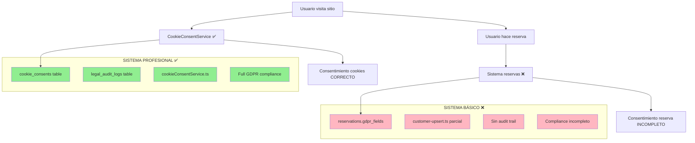
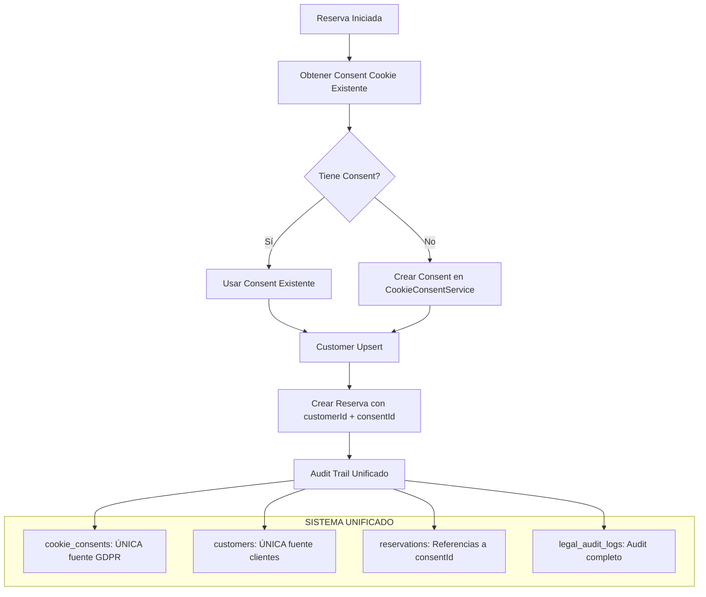

# 🚨 ANÁLISIS CRÍTICO: SISTEMA GDPR FRAGMENTADO

> **SITUACIÓN CRÍTICA IDENTIFICADA**: Existen DOS sistemas GDPR completamente desconectados en la aplicación

---

## 💀 SITUACIÓN ACTUAL: PESADILLA DE COMPLIANCE

### ❌ PROBLEMA FUNDAMENTAL: DUAL GDPR SYSTEMS



---

## 🔍 EVIDENCIA FORENSE DE LA DB

### ✅ SISTEMA PROFESIONAL (FUNCIONA)
```sql
-- cookie_consents: 2 registros REALES y COMPLETOS
SELECT * FROM restaurante.cookie_consents;
-- RESULTADO: Consentimientos con audit trail completo
id: cc_2530cbd5-4abb-43cf-945c-48480c2abae7
customer_id: larion2594@gmail.com
necessary_cookies: true
analytics_cookies: true
marketing_cookies: true
consent_timestamp: 2025-09-19 12:38:25.613741+02
ip_address: ::1
user_agent: Mozilla/5.0 (Macintosh; Intel Mac OS X 10_15_7)...
gdpr_lawful_basis: consent
policy_version: v1.0
-- ✅ COMPLETAMENTE COMPLIANT CON GDPR/AEPD
```

### ❌ SISTEMA BÁSICO (ROTO)
```sql
-- reservations: Campos GDPR todos FALSE/NULL
SELECT dataProcessingConsent, emailConsent, marketingConsent,
       consentDataProcessing, consentDataProcessingTimestamp,
       customerId FROM restaurante.reservations;
-- RESULTADO: TODO VACÍO O FALSE
dataProcessingConsent = false
emailConsent = false
marketingConsent = false
consentDataProcessing = false
consentDataProcessingTimestamp = NULL
customerId = NULL
-- ❌ COMPLETAMENTE INCOMPLIANT
```

### 🚫 AUDIT TRAIL ROTO
```sql
-- legal_audit_logs: 0 registros (DEBERÍA TENER DATOS)
SELECT COUNT(*) FROM restaurante.legal_audit_logs;
-- RESULTADO: 0 registros
-- ❌ NO HAY AUDIT TRAIL PARA NADA
```

---

## 🧬 ANÁLISIS TÉCNICO DETALLADO

### 1. CookieConsentService.ts (NIVEL ENTERPRISE)

**Características Profesionales:**
- ✅ **Zod validation** completa con schemas
- ✅ **AEPD 2025 compliance** (24 meses máximo)
- ✅ **Audit trail** con legal_audit_logs
- ✅ **Granular permissions** por categoría de cookies
- ✅ **Withdrawal management** (GDPR Art. 7.3)
- ✅ **Expiry management** automático
- ✅ **IP & User Agent tracking** para compliance
- ✅ **Statistics & reporting** para dashboard
- ✅ **Session & Customer** linking

**Funcionalidades Avanzadas:**
```typescript
// Métodos profesionales implementados
createConsent()           // ✅ Crear consentimiento completo
updateConsent()           // ✅ Actualizar con audit trail
withdrawConsent()         // ✅ GDPR Art. 7.3 compliance
getActiveConsentByCustomer() // ✅ Validación por cliente
canUseCookieCategory()    // ✅ Permisos granulares
getExpiredConsents()      // ✅ Gestión de expiración
getConsentStatistics()    // ✅ Reporting compliance
logConsentActivity()      // ✅ Audit trail (CON BUG)
```

### 2. Sistema Reservas (NIVEL BÁSICO)

**Características Problemáticas:**
- ❌ **Campos duplicados** sin usar (consentDataProcessing vs dataProcessingConsent)
- ❌ **Sin audit trail** para consentimientos
- ❌ **Customer upsert roto** (customerId NULL)
- ❌ **Sin IP tracking** para compliance
- ❌ **Sin expiry management**
- ❌ **Sin withdrawal capability**
- ❌ **Timestamps inconsistentes**

---

## 🐛 BUGS CRÍTICOS IDENTIFICADOS

### Bug #1: DOBLE AWAIT en Audit Logging
```typescript
// src/lib/services/legal/cookieConsentService.ts:528-529
private async logConsentActivity() {
  await await this.getSupabaseClient(request)  // ❌ DOBLE AWAIT
  //     ^^^^^ CAUSA ERROR Y NO SE GUARDA AUDIT TRAIL
}
```

**Impacto:** El audit trail legal no funciona (0 registros en legal_audit_logs)

### Bug #2: Sistemas GDPR Desconectados
```typescript
// Sistema cookies usa: CookieConsentService ✅
// Sistema reservas usa: campos básicos en tabla ❌
// NO HAY INTEGRACIÓN entre ambos
```

**Impacto:** Doble consentimiento, compliance fragmentado

### Bug #3: Customer Upsert No Ejecutado
```typescript
// customer-upsert.ts existe pero NO se llama en reservas
// Resultado: customerId = NULL en todas las reservas
```

**Impacto:** Sin linking entre consentimientos y clientes

---

## 🎯 SOLUCIÓN: UNIFICACIÓN DE SISTEMAS GDPR

### ESTRATEGIA: Migrar Reservas al Sistema Profesional



### IMPLEMENTACIÓN TÉCNICA

#### 1. Fix Critical Bugs
```typescript
// Fix cookieConsentService.ts audit logging
private async logConsentActivity() {
  const supabase = await this.getSupabaseClient(request)  // ✅ UN SOLO AWAIT
  await supabase.from('legal_audit_logs').insert({...})
}
```

#### 2. Integrar Reservas con CookieConsentService
```typescript
// src/app/api/reservations/route.ts - NUEVA IMPLEMENTACIÓN
export async function POST(request: NextRequest) {
  // 1. Obtener consent existente del usuario (si existe)
  const sessionId = extractSessionId(request)
  const existingConsent = await cookieConsentService.getActiveConsentBySession(request, sessionId)

  let consentId: string

  if (existingConsent) {
    // Usar consent existente de cookies
    consentId = existingConsent.consent_id
  } else {
    // Crear nuevo consent en sistema profesional
    const newConsent = await cookieConsentService.createConsent(request, {
      consent_id: `reservation_${Date.now()}_${crypto.randomUUID().slice(0, 8)}`,
      session_id: sessionId,
      customer_id: data.email, // Temporal hasta customer upsert
      consent_method: 'reservation_form',
      necessary_cookies: true,
      analytics_cookies: data.emailConsent,
      marketing_cookies: data.marketingConsent,
      functionality_cookies: true,
      security_cookies: false,
      page_url: request.headers.get('referer') || '/reservas',
      referrer: request.headers.get('referer') || ''
    }, userAgent, ipAddress)

    consentId = newConsent.data.consent_id
  }

  // 2. Customer upsert (ARREGLAR)
  const { customerId } = await upsertCustomer({
    ...extractCustomerDataFromReservation(data),
    consentId // LINK con sistema GDPR profesional
  })

  // 3. Crear reserva SIN campos GDPR duplicados
  const reservationPayload = {
    // ... campos normales ...
    customerId: customerId,           // ✅ LINK a customer
    gdprConsentId: consentId,         // ✅ LINK a consent profesional
    // ELIMINAR todos los campos GDPR duplicados:
    // - dataProcessingConsent
    // - emailConsent
    // - marketingConsent
    // - consentDataProcessing*
    // - etc.
  }
}
```

#### 3. Actualizar Schema Reservations
```sql
-- Eliminar campos GDPR duplicados y añadir referencia
ALTER TABLE restaurante.reservations
  ADD COLUMN gdpr_consent_id TEXT REFERENCES restaurante.cookie_consents(consent_id);

-- Los campos GDPR existentes se pueden mantener por compatibilidad
-- pero no usar en nuevo código
```

#### 4. Customer Upsert Integration
```typescript
// src/lib/customer-upsert.ts - INTEGRAR CON GDPR
export async function upsertCustomer(data: CustomerUpsertData & { consentId?: string }) {
  // ... lógica existente ...

  if (data.consentId) {
    // Actualizar consent con customer_id real
    await cookieConsentService.updateConsent(request, data.consentId, {
      customer_id: newCustomer.id
    }, ipAddress, userAgent)
  }

  return { customerId: newCustomer.id, ... }
}
```

---

## 📋 PLAN DE IMPLEMENTACIÓN

### FASE 1: CRITICAL FIXES (1 día)
1. **Fix doble await** en cookieConsentService.ts
2. **Test audit trail** funciona correctamente
3. **Verificar** legal_audit_logs se popula

### FASE 2: INTEGRATION (2 días)
1. **Integrar reservas** con cookieConsentService
2. **Actualizar customer upsert** para linkear con GDPR
3. **Eliminar campos GDPR duplicados** de reservas

### FASE 3: VALIDATION (1 día)
1. **Testing** end-to-end flujo unificado
2. **Verificar compliance** GDPR/AEPD completo
3. **Dashboard** de consent statistics

### FASE 4: CLEANUP (1 día)
1. **Migrar datos existentes** al sistema unificado
2. **Deprecar** campos GDPR antiguos
3. **Documentar** sistema GDPR unificado

---

## 🎯 BENEFICIOS DE LA UNIFICACIÓN

### Compliance
- ✅ **GDPR Art. 7 completo**: Consent, withdrawal, audit trail
- ✅ **AEPD 2025 compliant**: 24 meses, categorías granulares
- ✅ **Audit trail completo**: Todos los eventos registrados
- ✅ **IP & User Agent tracking**: Compliance forense

### Técnico
- ✅ **Sistema único GDPR**: No más duplicación
- ✅ **Arquitectura limpia**: Referencias entre tablas
- ✅ **Performance**: Menos campos redundantes
- ✅ **Mantenibilidad**: Un solo sistema que mantener

### Negocio
- ✅ **Dashboard unificado**: Estadísticas centralizadas
- ✅ **Gestión simplificada**: Un solo flujo consent
- ✅ **Escalabilidad**: Fácil añadir nuevos tipos consent
- ✅ **Compliance reporting**: Automático y completo

---

## ⚠️ RIESGO LEGAL ACTUAL

**ESTADO ACTUAL**: Sistema fragmentado con compliance parcial
- Cookies ✅ Compliant GDPR
- Reservas ❌ Non-compliant GDPR
- Audit ❌ Roto por bug técnico

**ESTADO POST-FIX**: Sistema unificado completamente compliant
- Todo ✅ Compliant GDPR/AEPD 2025
- Audit ✅ Trail completo
- Reporting ✅ Dashboard automático

---

*Este análisis revela una situación crítica: existe un sistema GDPR profesional de nivel enterprise que NO está siendo usado por el flujo principal de reservas. La solución requiere integración técnica urgente.*