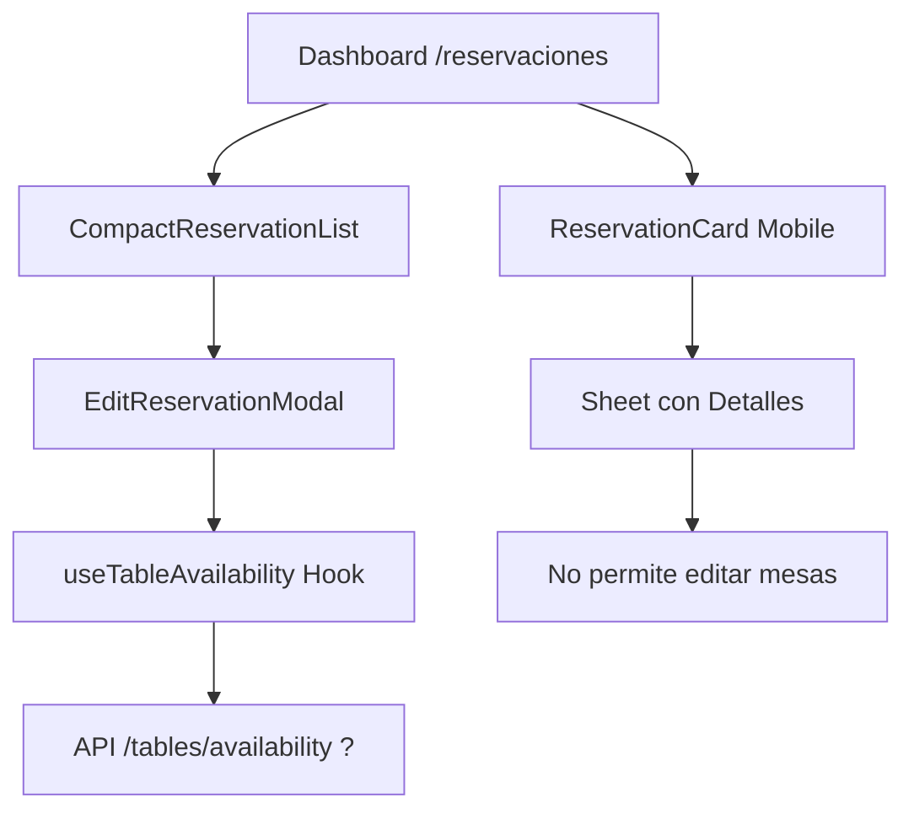

# 📋 INFORME: Sistema de Edición de Reservas y Parámetro `includePrivate`

> **Fecha**: 2025-10-14
> **Objetivo**: Asegurar que todos los componentes de edición de reservas del dashboard admin pasen `includePrivate=true`

---

## 🔍 COMPONENTES IDENTIFICADOS

### 1. **ReservationCard** (Versión Móvil)
- **Ubicación**: `/src/components/reservations/ReservationCard.tsx`
- **Uso**: Tarjeta de reserva responsive (mobile-first)
- **Modal de Edición**: ❌ **NO usa EditReservationModal**
- **Acciones**: Ver detalle, Confirmar, No Show, Cancelar, WhatsApp
- **Status**: ⚠️ **NO tiene funcionalidad de editar mesas directamente**

### 2. **CompactReservationList** (Vista de Lista)
- **Ubicación**: `/src/app/(admin)/dashboard/reservaciones/components/compact-reservation-list.tsx`
- **Línea**: 1075
- **Uso**: Lista compacta de reservas en dashboard
- **Modal de Edición**: ✅ **USA EditReservationModal**
- **Status**: ⚠️ **REQUIERE VERIFICACIÓN**

### 3. **EditReservationModal** (Modal Principal)
- **Ubicación**: `/src/app/(admin)/dashboard/reservaciones/components/edit-reservation-modal.tsx`
- **Hook Usado**: `useTableAvailability` (línea 39)
- **NO usa**: `useReservations` ni `checkAvailability`
- **Status**: ⚠️ **REQUIERE ANÁLISIS DEL HOOK**

---

## 🔧 HOOKS IDENTIFICADOS

### A. `useReservations`
- **Ubicación**: `/src/hooks/useReservations.ts`
- **Función**: `checkAvailability(dateTime, partySize, location, includePrivate)`
- **Status**: ✅ **YA ACTUALIZADO** (línea 71)
- **Usado en**:
  - ✅ `reservation-form.tsx` (formulario admin nueva reserva)
  - ❓ Otros componentes pendientes de verificar

### B. `useTableAvailability`
- **Ubicación**: `/src/hooks/useTableAvailability.ts`
- **Usado en**: `EditReservationModal`
- **Status**: ❌ **REQUIERE LECTURA Y ACTUALIZACIÓN**

### C. `useBusinessHours`
- **Ubicación**: `/src/hooks/useBusinessHours.ts`
- **Usado en**: `EditReservationModal` (línea 17)
- **Status**: ❓ **REQUIERE VERIFICACIÓN**

---

## 📊 FLUJO ACTUAL DE EDICIÓN



---

## ⚠️ PROBLEMAS IDENTIFICADOS

### 1. **EditReservationModal usa `useTableAvailability`**
   - ❌ NO usa `useReservations.checkAvailability`
   - ❌ No pasa `includePrivate`
   - **Riesgo**: Al editar reserva desde dashboard, NO verá mesas S9, S10, S10-B

### 2. **ReservationCard NO tiene edición de mesas**
   - Solo muestra detalles en un Sheet
   - ❌ No permite cambiar mesas asignadas
   - **Impacto**: Menor (no es funcionalidad crítica)

### 3. **Hook `useTableAvailability` sin analizar**
   - Ubicación: `/src/hooks/useTableAvailability.ts`
   - **Necesita**: Lectura completa para ver si llama a la API
   - **Acción requerida**: Agregar parámetro `includePrivate`

---

## ✅ PLAN DE ACCIÓN

### Paso 1: Analizar `useTableAvailability`
```typescript
// Leer archivo completo
/src/hooks/useTableAvailability.ts
```
**Buscar**:
- ¿Llama a `/api/tables/availability`?
- ¿Tiene parámetro para admin context?
- ¿Cómo se usa en EditReservationModal?

### Paso 2: Actualizar `useTableAvailability` (si necesario)
```typescript
// Agregar parámetro includePrivate similar a useReservations
export const useTableAvailability = (
  date: string,
  time: string,
  partySize: number,
  includePrivate: boolean = false // NUEVO
) => {
  // ...
  const params = new URLSearchParams({
    includePrivate: includePrivate.toString()
  })
  // ...
}
```

### Paso 3: Modificar `EditReservationModal`
```typescript
// En edit-reservation-modal.tsx (línea ~39)
const { availableTables } = useTableAvailability(
  selectedDate,
  selectedTime,
  partySize,
  true // Admin context - incluir mesas privadas
)
```

### Paso 4: Verificar `CompactReservationList`
- Confirmar que usa EditReservationModal correctamente
- Verificar que pasa todas las props necesarias

---

## 📝 ARCHIVOS A MODIFICAR

| # | Archivo | Línea | Cambio Requerido |
|---|---------|-------|------------------|
| 1 | `/src/hooks/useTableAvailability.ts` | TBD | Agregar parámetro `includePrivate` |
| 2 | `/src/app/(admin)/dashboard/reservaciones/components/edit-reservation-modal.tsx` | ~39-50 | Pasar `includePrivate=true` al hook |
| 3 | `/src/app/(admin)/dashboard/reservaciones/components/compact-reservation-list.tsx` | 1075 | Verificar que pasa props correctas |

---

## 🎯 RESULTADO ESPERADO

Después de los cambios:

✅ **EditReservationModal** (desde dashboard):
- ✅ Ve mesas S9, S10, S10-B (privadas)
- ✅ Puede asignarlas a reservas
- ✅ Funciona igual que formulario de nueva reserva

✅ **CompactReservationList**:
- ✅ Botón "Editar" abre modal con todas las mesas disponibles
- ✅ Admin puede reasignar a mesas comodín

❌ **ReservationCard** (móvil):
- ❌ NO tiene funcionalidad de editar (solo ver)
- ℹ️ No requiere cambios (no es crítico)

---

## 🚨 PRIORIDAD

| Componente | Prioridad | Urgencia |
|------------|-----------|----------|
| useTableAvailability | 🔴 ALTA | Bloquea edición admin |
| EditReservationModal | 🔴 ALTA | Necesita hook actualizado |
| CompactReservationList | 🟡 MEDIA | Verificación de props |
| ReservationCard | 🟢 BAJA | No tiene funcionalidad |

---

## 📊 ESTADO ACTUAL

- ✅ **API `/api/tables/availability`**: Filtro `includePrivate` implementado
- ✅ **API `/api/zones/active`**: Filtro `is_public` implementado
- ✅ **Hook `useReservations`**: Parámetro `includePrivate` agregado
- ✅ **Formulario nueva reserva admin**: Pasa `includePrivate=true`
- ❌ **Hook `useTableAvailability`**: Sin parámetro `includePrivate`
- ❌ **EditReservationModal**: No pasa contexto admin
- ⚠️ **CompactReservationList**: Sin verificar

---

**Status**: 📋 **ANÁLISIS COMPLETADO - ACCIÓN REQUERIDA**

**Próximo paso**: Leer `/src/hooks/useTableAvailability.ts` y proceder con modificaciones.
