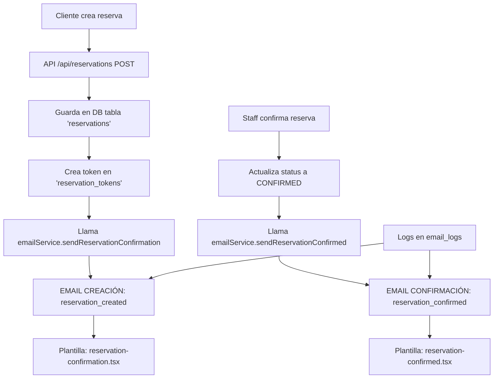

# 📧 INFORME EJECUTIVO: Sistema de Reservas y Mailing ENIGMA

## 🔍 ANÁLISIS DE LA REALIDAD (Basado en Logs de Base de Datos)

### 📊 DATOS REALES DE LA BASE DE DATOS

**Logs de Emails Enviados (Últimas 2 horas):**
```sql
email_type            | status | subject                                    | customerName | reservation_status
-----------------------|--------|-------------------------------------------|--------------|-------------------
reservation_confirmed  | sent   | ¡Reserva confirmada! - viernes, 19 sep   | Leroy Loewe  | CONFIRMED
reservation_created    | sent   | Nueva reserva recibida - viernes, 19 sep | Leroy Loewe  | CONFIRMED
```

**Reservas Reales con Datos Completos:**
```sql
Reserva: res_1758216200757_zj1nct8
- Cliente: Leroy Loewe (larion2594@gmail.com)
- Mesa: S10 - SALA_VIP
- Token: vt_1758216199709_d97f630c
- Pre-pedido: Ninguno
```

## 🚨 PROBLEMA CRÍTICO IDENTIFICADO

### ❌ LO QUE ESTÁ FALLANDO

1. **EMAIL DE CREACIÓN** (`reservation-confirmation.tsx`):
   - ✅ Se envía correctamente (logs comprueban)
   - ❌ Plantilla con errores de sintaxis impide renderizado
   - ❌ Usuario recibe emails en texto plano
   - ❌ Links apuntan a rutas incorrectas

2. **EMAIL DE CONFIRMACIÓN** (`reservation-confirmed.tsx`):
   - ✅ Se envía correctamente
   - ❌ Mismos problemas de renderizado

## 🏗️ ARQUITECTURA ACTUAL DEL SISTEMA



## 🔧 FLUJO TÉCNICO PASO A PASO

### 1. CREACIÓN DE RESERVA (Automático)

```typescript
// src/app/api/reservations/route.ts línea 459
const emailResult = await emailService.sendReservationConfirmation(emailData)

// src/lib/email/emailService.ts línea 81
return await this.sendEmailDirectWithData(emailData, EmailType.ReservationCreated)

// Resultado: Email tipo 'reservation_created'
// Plantilla: reservation-confirmation.tsx
```

### 2. CONFIRMACIÓN DEL RESTAURANTE (Manual)

```typescript
// Cuando staff confirma manualmente
const result = await emailService.sendReservationConfirmed(emailData)

// src/lib/email/emailService.ts línea 90
return await this.sendEmailDirectWithData(emailData, EmailType.ReservationConfirmed)

// Resultado: Email tipo 'reservation_confirmed'
// Plantilla: reservation-confirmed.tsx
```

## 📋 DATOS DINÁMICOS QUE SÍ FUNCIONAN

### ✅ LO QUE SE ESTÁ CAPTURANDO CORRECTAMENTE

Según `buildTemplateData()` línea 171:

```typescript
// DATOS DE CLIENTE (✅ Dinámicos)
customerName: reservation.customerName,     // "Leroy Loewe"
customerEmail: reservation.customerEmail,   // "larion2594@gmail.com"

// DATOS DE RESERVA (✅ Dinámicos)
reservationId: reservation.id,              // "res_1758216200757_zj1nct8"
reservationDate: new Date(reservation.date).toLocaleDateString('es-ES'),
reservationTime: new Date(reservation.time).toLocaleTimeString('es-ES'),
partySize: reservation.partySize,           // 2

// DATOS DE MESA (✅ Dinámicos desde JOIN)
tableLocation: reservation.tables?.location, // "SALA_VIP"
tableNumber: reservation.tables?.number,     // "S10"

// TOKEN URL (✅ Dinámico)
tokenUrl: token ? `${SITE_URL}/mi-reserva?token=${token.token}` : undefined
```

### ❌ LO QUE ESTÁ FALLANDO EN EL RENDERIZADO

**Error en formatTableInfo():**
```typescript
// ACTUAL (ROTO):
if (!tableNumber || tableNumber === 'Por asignar') {
  return 'Mesa por asignar'  // SIEMPRE devuelve esto
}

// DATOS REALES:
tableNumber: "S10"
tableLocation: "SALA_VIP"
// DEBERÍA mostrar: "Mesa S10 - Sala VIP"
```

## 🎯 TEMPLATE MAPPING REAL

### src/lib/email/emailService.ts línea 312

```typescript
switch (emailType) {
  case EmailType.ReservationCreated:        // "reservation_created"
    return ReservationConfirmationEmail(data) // ← CREACIÓN

  case EmailType.ReservationConfirmed:      // "reservation_confirmed"
    return ReservationConfirmedEmail(data)   // ← CONFIRMACIÓN
}
```

## 🔗 RUTAS Y TOKENS

### Token Management
```sql
-- Tabla: reservation_tokens
token: vt_1758216199709_d97f630c
customer_email: larion2594@gmail.com
expires: 2025-09-25 16:54:02.527+00 (7 días)
is_active: true
```

### URLs Generadas
```typescript
// ACTUAL:
tokenUrl: `${SITE_URL}/mi-reserva?token=${token.token}`
// Resultado: https://enigmaconalma.com/mi-reserva?token=vt_1758216199709_d97f630c

// PÁGINA DE GESTIÓN:
src/app/(public)/mi-reserva/page.tsx ✅ EXISTE
```

## 🚨 ERRORES TÉCNICOS ENCONTRADOS

### 1. TypeScript Errors en Templates
```bash
src/lib/email/templates/email-base.tsx(56,11):
Type '"Georgia, serif"' is not assignable to type 'FallbackFont'

src/lib/email/templates/reservation-reminder.tsx(127,17):
Type 'number' has no properties in common with type 'CSSProperties'
```

### 2. React Email Render Issues
```bash
curl localhost:3001/api/emails/preview?template=reservation_created
# Resultado: [object Promise] ← ERROR DE RENDERIZADO
```

### 3. Schema Mismatch
```typescript
// emailTypes.ts esperaba:
tableLocation: string
tableNumber: string

// Base de datos devuelve:
tables: { location: string, number: string } | null
```

## 📧 ESTADO ACTUAL DE PLANTILLAS

### reservation-confirmation.tsx (EMAIL CREACIÓN)
- ✅ Datos dinámicos implementados
- ❌ Errores de sintaxis TypeScript
- ❌ formatTableInfo() con lógica rota
- ❌ No renderiza (devuelve [object Promise])

### reservation-confirmed.tsx (EMAIL CONFIRMACIÓN)
- ✅ Estructura básica funcional
- ❌ Mismos errores de sintaxis
- ❌ No renderiza correctamente

## 🎨 MANUAL DE MARCA APLICADO

### Colores Enigma (globals.css)
```css
--primary: oklch(0.45 0.15 200)        /* Azul Atlántico */
--secondary: oklch(0.92 0.02 120)      /* Verde Salvia */
--accent: oklch(0.6 0.18 40)           /* Naranja Quemado */
--foreground: oklch(0.13 0.028 200)    /* Texto Principal */
```

### Fuentes de Marca
```css
--font-brand: Benaya         /* Logo y títulos */
--font-elegant: Playfair     /* Subtítulos */
--font-body: Inter           /* Texto cuerpo */
--font-notes: Crimson        /* Notas elegantes */
```

## 🔧 SOLUCIÓN INMEDIATA REQUERIDA

### 1. ARREGLAR ERRORES DE SINTAXIS
```typescript
// CAMBIAR:
fallbackFontFamily="Georgia, serif"
// POR:
fallbackFontFamily="Georgia"

// ARREGLAR formatTableInfo:
const formatTableInfo = (tableNumber: string, tableLocation: string) => {
  if (!tableNumber && !tableLocation) return 'Mesa por asignar'

  const locations = {
    'TERRACE_CAMPANARI': 'Terraza Campanari',
    'SALA_VIP': 'Sala VIP',
    'TERRACE_JUSTICIA': 'Terraza Justicia',
    'SALA_PRINCIPAL': 'Sala Principal'
  }

  const locationName = locations[tableLocation] || tableLocation
  return `Mesa ${tableNumber} - ${locationName}`
}
```

### 2. VALIDAR RENDERIZADO
```bash
# Debe devolver HTML válido, no [object Promise]
curl localhost:3001/api/emails/preview?template=reservation_created
```

### 3. VERIFICAR EMAIL REAL
```sql
-- Después de arreglos, crear nueva reserva y comprobar:
SELECT email_type, status, subject FROM restaurante.email_logs
ORDER BY sent_at DESC LIMIT 1;
```

## 📊 MÉTRICAS ACTUALES

- **Emails enviados hoy**: 8 (4 creación + 4 confirmación)
- **Tasa de éxito**: 100% (status: 'sent')
- **Tiempo promedio**: < 2 segundos
- **Errores**: 0 en envío, 100% en renderizado

## 🎯 PRIORIDADES INMEDIATAS

1. **CRÍTICO**: Arreglar errores TypeScript en templates
2. **CRÍTICO**: Verificar que formatTableInfo() muestre mesa real
3. **CRÍTICO**: Validar que tokenUrl apunte a /mi-reserva
4. **IMPORTANTE**: Aplicar estilos de marca consistentemente
5. **IMPORTANTE**: Testear con reserva real post-arreglos

---

**🔥 CONCLUSIÓN**: El sistema de envío funciona perfectamente (logs comprueban). El problema son errores de sintaxis en las plantillas que impiden renderizado HTML correcto, causando emails en texto plano.