# MESSAGING.md - Plan de Integración Email Enigma Restaurant

## 📧 RESUMEN EJECUTIVO

Sistema completo de mensajería email para confirmaciones de reservas con tokens únicos, integrado con Hostinger (titan.email) y el sistema de reservas existente.

**Configuración Principal:**
- **SMTP**: `admin@enigmaconalma.com` → `smtp.titan.email:465`
- **Sender**: `info@enigmaconalma.com`
- **Target**: Confirmaciones automáticas de reservas
- **Token System**: UUID v4 con expiración 48h

## 🏗️ ARQUITECTURA TÉCNICA

## 🏗️ ARQUITECTURA PROFESIONAL (CLEAN ARCHITECTURE + ENUM PATTERNS)

### 1. **Service Layer Interface (PROFESSIONAL STANDARD)**
```typescript
// src/lib/email/emailService.ts - CLEAN ARCHITECTURE PATTERN
export enum EmailResult {
  Ok = 'ok',
  SmtpError = 'smtp_error',
  TemplateNotFound = 'template_not_found',
  ReservationNotFound = 'reservation_not_found',
  RateLimitExceeded = 'rate_limit_exceeded',
  InvalidEmail = 'invalid_email'
}

export enum EmailType {
  ReservationCreated = 'reservation_created',
  ReservationConfirmed = 'reservation_confirmed',
  ReservationReminder = 'reservation_reminder',
  ReservationReview = 'reservation_review',
  ReservationCancelled = 'reservation_cancelled'
}

interface EmailService {
  sendReservationEmail(reservationId: string, type: EmailType): Promise<EmailResult>
  getEmailStatus(messageId: string): Promise<EmailStatus>
  scheduleEmail(reservationId: string, type: EmailType, scheduledFor: Date): Promise<EmailResult>
}
```

### 2. **Token Service (ONE-TIME USE PATTERN FROM SPATIE/LARAVEL)**
```typescript
// src/lib/tokens/tokenService.ts - PROFESSIONAL TOKEN MANAGEMENT
export enum TokenValidationResult {
  Ok = 'ok',
  NoTokenFound = 'no_token_found',
  IncorrectToken = 'incorrect_token',
  TokenExpired = 'token_expired',
  TokenAlreadyUsed = 'token_already_used',
  ReservationNotFound = 'reservation_not_found',
  OutsideModificationWindow = 'outside_modification_window'
}

export enum TokenAction {
  ViewReservation = 'view_reservation',
  ModifyReservation = 'modify_reservation',
  CancelReservation = 'cancel_reservation',
  SubmitReview = 'submit_review'
}

interface TokenService {
  // Token validation without consumption (read-only check)
  validateToken(token: string): Promise<TokenValidationResult>

  // Token consumption (one-time use - invalidates after use)
  consumeToken(token: string, action: TokenAction): Promise<TokenValidationResult>

  // Utility methods
  isTokenExpired(token: string): Promise<boolean>
  cleanupExpiredTokens(): Promise<number>

  // Professional error handling
  getValidationMessage(result: TokenValidationResult): string
}
```

### 3. **Use Cases Layer (CLEAN ARCHITECTURE DOMAIN SERVICES)**
```typescript
// src/lib/useCases/reservationEmailUseCase.ts
export class ReservationEmailUseCase {
  constructor(
    private emailService: EmailService,
    private tokenService: TokenService,
    private reservationRepository: ReservationRepository
  ) {}

  async handleReservationCreated(reservationId: string): Promise<EmailResult> {
    // Clean architecture - single responsibility
    const reservation = await this.reservationRepository.findById(reservationId)
    if (!reservation) return EmailResult.ReservationNotFound

    return await this.emailService.sendReservationEmail(reservationId, EmailType.ReservationCreated)
  }

  async handleReservationConfirmed(reservationId: string): Promise<EmailResult> {
    // Send confirmation email with SAME TOKEN (no regeneration)
    return await this.emailService.sendReservationEmail(reservationId, EmailType.ReservationConfirmed)
  }
}
```

### 3. Dynamic Template Engine (Database-Driven)
```typescript
// src/lib/email/templates/
interface EmailTemplate {
  id: string;
  name: string;
  subject_template: string;    // "Reserva {{status}} - {{customerName}}"
  html_template: string;       // JSX/React Email component
  text_template: string;       // Plain text fallback
  variables: string[];         // ["customerName", "date", "time", "partySize"]
  template_type: 'confirmation' | 'reminder' | 'modification' | 'review' | 'cancellation';
  is_active: boolean;
  created_at: string;
  updated_at: string;
}

// DYNAMIC TEMPLATE SYSTEM
- React Email Components (JSX-based)
- Database-stored templates (PostgreSQL)
- Real-time template editing capability
- Variable interpolation system
- Multi-language support ready
- A/B testing framework
```

### 4. Email Analytics & Tracking System
```typescript
interface EmailLog {
  id: string;
  reservation_id: string;
  template_id: string;
  recipient_email: string;
  subject: string;
  email_type: 'confirmation' | 'reminder' | 'modification' | 'review';
  sent_at: string;
  delivered_at?: string;
  opened_at?: string;
  clicked_at?: string;
  bounced_at?: string;
  tracking_pixel_id: string;
  message_id: string;         // SMTP message ID
  status: 'sent' | 'delivered' | 'opened' | 'clicked' | 'bounced' | 'failed';
  analytics: {
    device_type: string;      // mobile, desktop
    email_client: string;     // gmail, outlook
    location: string;         // IP-based location
    user_agent: string;
  };
}

// ANALYTICS CAPABILITIES
- Real-time delivery tracking
- Open rate monitoring (tracking pixels)
- Click-through rate analytics
- Device and client detection
- Geographic analytics
- A/B template performance comparison
```

### 5. Review & Rating System
```typescript
interface ReviewSystem {
  id: string;
  reservation_id: string;
  customer_email: string;
  internal_rating: number;    // 1-6 stars sistema interno
  review_text?: string;
  review_date: string;
  external_reviews: {
    tripadvisor_clicked: boolean;
    google_clicked: boolean;
    tripadvisor_url: string;
    google_url: string;
  };
  review_token: string;       // One-time access token
  completed: boolean;
}

// REVIEW LINKS & ANALYTICS
- TripAdvisor: Direct restaurant profile URL
- Google Reviews: Google My Business review URL
- Internal 6-star rating system
- Review completion tracking
- Customer satisfaction analytics
```

## 📱 FLUJO PROFESIONAL CORRECTO (CLEAN ARCHITECTURE)

### 🎯 **Flujo Real Simplificado**

#### 1. **RESERVATION CREATED (PENDING STATE)**
- ✅ Usuario crea reserva → Estado `PENDING`
- ✅ **TOKEN ÚNICO generado** (persiste durante todo el ciclo)
- ✅ **EMAIL INMEDIATO**: Detalles completos + token modificación
- ✅ Restaurante recibe notificación para confirmar/rechazar

#### 2. **RESTAURANT CONFIRMS (CONFIRMED STATE)**
- ✅ Restaurante cambia estado a `CONFIRMED`
- ✅ **EMAIL AUTOMÁTICO**: Confirmación oficial con **EL MISMO TOKEN**
- ✅ **Token NO cambia** - es el mismo que se generó al crear reserva
- ✅ Link modificación permanece válido hasta uso o expiración

#### 3. **TOKEN INVALIDATION RULES (ONE-TIME USE PATTERN)**
- ✅ **Token se invalida SOLO si:**
  - Usuario **USA** el token para modificar/cancelar (one-time use)
  - Se llega a **2h antes** de la reserva (time expiration)
- ✅ **Si usuario modifica**: Nuevo token + invalidación del anterior
- ✅ **Nueva reserva**: Estado vuelve a `PENDING` con nuevo token

#### 4. **REMINDER SYSTEM (12H BEFORE)**
- ✅ **Timing**: **12 horas antes** (industry standard)
- ✅ **EMAIL RECORDATORIO**: Detalles finales + mismo token válido
- ✅ **Smart Logic**: Si reserva < 12h, envío inmediato tras confirmación
- ✅ **No envío**: Si reserva cancelada o token ya usado

#### 5. **REVIEW & ANALYTICS SYSTEM**
- ✅ **Timing**: 2h después de hora reserva (completion trigger)
- ✅ **EMAIL RESEÑA**: TripAdvisor + Google + 6 estrellas internas
- ✅ **Nuevo token reseña**: One-time access para rating interno
- ✅ **Analytics tracking**: Click-through rates externos

### 4. **Next.js Integration Points (PROFESSIONAL MIDDLEWARE PATTERN)**
```typescript
// src/hooks/useRealtimeReservations.ts - INTEGRATION WITH CLEAN ARCHITECTURE
import { EmailType, EmailResult } from '@/lib/email/emailService'
import { ReservationEmailUseCase } from '@/lib/useCases/reservationEmailUseCase'

const updateReservationStatus = async (id: string, status: string, additionalData?: any): Promise<boolean> => {
  try {
    const response = await fetch(`/api/reservations/${id}`, {
      method: 'PATCH',
      headers: { 'Content-Type': 'application/json' },
      body: JSON.stringify({ status, ...additionalData })
    })

    if (response.ok) {
      // Existing optimistic update...
      setReservations(prev =>
        prev.map(reservation =>
          reservation.id === id
            ? { ...reservation, status: status as any, ...additionalData }
            : reservation
        )
      )

      // ✨ PROFESSIONAL EMAIL AUTOMATION (CLEAN ARCHITECTURE)
      const emailUseCase = new ReservationEmailUseCase(emailService, tokenService, reservationRepository)

      switch (status) {
        case 'CONFIRMED':
          // Send confirmation with SAME TOKEN (no regeneration)
          const confirmResult = await emailUseCase.handleReservationConfirmed(id)
          if (confirmResult !== EmailResult.Ok) {
            console.warn('Email confirmation failed:', confirmResult)
          }
          break

        case 'CANCELLED':
          // Send cancellation notification
          await emailService.sendReservationEmail(id, EmailType.ReservationCancelled)
          break
      }

      updateSummaryAfterStatusChange(status)
      return true
    }

    // Professional error handling
    const errorData = await response.json()
    setError(errorData.error || 'Error updating reservation')
    return false

  } catch (err) {
    setError('Network error updating reservation')
    console.error('Error updating reservation:', err)
    return false
  }
}
```

### 5. **API Route Implementation (SSR PATTERN)**
```typescript
// src/app/api/email/send/route.ts - NEXT.JS 15 + ENUM PATTERNS
import { EmailResult, EmailType } from '@/lib/email/emailService'
import { NextRequest, NextResponse } from 'next/server'

export async function POST(request: NextRequest) {
  try {
    const { reservationId, type } = await request.json()

    // Input validation
    if (!reservationId || !Object.values(EmailType).includes(type)) {
      return NextResponse.json({
        success: false,
        error: 'Invalid request parameters'
      }, { status: 400 })
    }

    // Use professional service layer
    const result = await emailService.sendReservationEmail(reservationId, type)

    // Enum-based response handling
    switch (result) {
      case EmailResult.Ok:
        return NextResponse.json({ success: true, result })

      case EmailResult.ReservationNotFound:
        return NextResponse.json({
          success: false,
          error: 'Reservation not found'
        }, { status: 404 })

      case EmailResult.SmtpError:
        return NextResponse.json({
          success: false,
          error: 'Email delivery failed'
        }, { status: 500 })

      default:
        return NextResponse.json({
          success: false,
          error: `Email failed: ${result}`
        }, { status: 400 })
    }

  } catch (error) {
    console.error('Email API error:', error)
    return NextResponse.json({
      success: false,
      error: 'Internal server error'
    }, { status: 500 })
  }
}
```

## 🔐 SECURITY & TOKEN ARCHITECTURE

### Token Structure (REAL DATABASE SCHEMA)
```sql
-- restaurante.reservation_tokens (ALREADY EXISTS - VALIDATED)
CREATE TABLE reservation_tokens (
  id text PRIMARY KEY DEFAULT ('rt_' || gen_random_uuid()),
  reservation_id text NOT NULL REFERENCES reservations(id) ON DELETE CASCADE,
  token text UNIQUE NOT NULL,
  customer_email text NOT NULL,  -- NOTE: customer_email NOT email
  expires timestamp with time zone NOT NULL,  -- NOTE: expires NOT expires_at
  created_at timestamp with time zone DEFAULT now(),
  used_at timestamp with time zone NULL,
  is_active boolean DEFAULT true,  -- NEW: Active flag for soft delete
  purpose text DEFAULT 'reservation_management'  -- NOTE: text NOT enum
);

-- INDEXES (ALREADY EXIST)
CREATE UNIQUE INDEX reservation_tokens_token_key ON reservation_tokens(token);
CREATE INDEX idx_reservation_tokens_active_unexpired ON reservation_tokens(is_active, expires) WHERE is_active = true;
CREATE INDEX idx_reservation_tokens_customer_email ON reservation_tokens(customer_email);
CREATE INDEX idx_reservation_tokens_reservation_id ON reservation_tokens(reservation_id);

-- RLS POLICIES (ALREADY EXIST)
-- customers_can_access_own_tokens, public_token_validation, service_role_full_access
```

### TypeScript Interface (Real Database Fields)
```typescript
// REAL DATABASE INTERFACE (VALIDATED WITH ACTUAL DB)
interface ReservationToken {
  id: string;                    // text: 'rt_' + UUID
  reservation_id: string;        // text: FK to reservations(id)
  token: string;                 // text: Unique secure token (UUID v4)
  customer_email: string;        // text: Customer email (NOTE: customer_email NOT email)
  expires: string;               // timestamp: ISO string (NOTE: expires NOT expiresAt)
  created_at: string;            // timestamp: ISO string
  used_at: string | null;        // timestamp: Null until used
  is_active: boolean;            // boolean: Active flag for soft delete
  purpose: string;               // text: 'reservation_management' (NOTE: text NOT enum)
}

// Token Service debe usar estos campos exactos
interface TokenService {
  generateReservationToken(reservationId: string, customerEmail: string, purpose: string): Promise<string>
  validateToken(token: string): Promise<ReservationToken | null>
  markTokenAsUsed(token: string): Promise<boolean>
  deactivateToken(token: string): Promise<boolean>
  cleanupExpiredTokens(): Promise<number>
}
```

### Security Measures (VALIDATED WITH BEST PRACTICES)

#### 🔐 Token Invalidation Strategy
- ✅ **One-time use**: Token invalidated immediately after use
- ✅ **Rotation system**: New token invalidates ALL previous tokens
- ✅ **Bulk invalidation**: All reservation tokens invalidated on modification
- ✅ **Time-based expiry**: Auto-invalidation at 2h before reservation
- ✅ **Revocation database**: Real-time token validation against blacklist
- ✅ **Chain invalidation**: Parent token invalidation cascades to children

#### 🛡️ Security Implementation
- ✅ **UUID v4 tokens** (128-bit entropy)
- ✅ **Short-lived tokens** (15-60 minutes for modification actions)
- ✅ **48-hour max expiration** window
- ✅ **HTTPS-only transmission** (TLS 1.2+)
- ✅ **Rate limiting** (max 3 tokens per reservation per hour)
- ✅ **IP validation** (optional: bind token to IP address)
- ✅ **User-Agent tracking** for security analytics

#### 📊 Security Analytics & Monitoring
- ✅ **Token reuse detection** → Automatic invalidation + alert
- ✅ **Suspicious activity tracking** → Bulk token revocation
- ✅ **Failed validation logging** → Security incident reports
- ✅ **Anomaly detection** → Pattern-based token protection
- ✅ **Real-time monitoring** → Continuous validation against blacklist

## 🗄️ NUEVAS TABLAS DE BASE DE DATOS

### Email Templates (Dynamic Template Storage)
```sql
CREATE TABLE restaurante.email_templates (
  id text PRIMARY KEY DEFAULT ('tpl_' || gen_random_uuid()),
  name text NOT NULL,
  subject_template text NOT NULL,
  html_template text NOT NULL,        -- JSX/React Email component as string
  text_template text,                 -- Plain text fallback
  variables text[] DEFAULT '{}',      -- ["customerName", "date", "time"]
  template_type text NOT NULL,        -- confirmation, reminder, modification, review
  is_active boolean DEFAULT true,
  created_at timestamp with time zone DEFAULT now(),
  updated_at timestamp with time zone DEFAULT now(),

  CONSTRAINT valid_template_type CHECK (template_type IN ('confirmation', 'reminder', 'modification', 'review', 'cancellation'))
);
```

### Email Logs (Analytics & Tracking)
```sql
CREATE TABLE restaurante.email_logs (
  id text PRIMARY KEY DEFAULT ('log_' || gen_random_uuid()),
  reservation_id text NOT NULL REFERENCES restaurante.reservations(id) ON DELETE CASCADE,
  template_id text REFERENCES restaurante.email_templates(id),
  recipient_email text NOT NULL,
  subject text NOT NULL,
  email_type text NOT NULL,
  sent_at timestamp with time zone DEFAULT now(),
  delivered_at timestamp with time zone,
  opened_at timestamp with time zone,
  clicked_at timestamp with time zone,
  bounced_at timestamp with time zone,
  tracking_pixel_id text UNIQUE,
  message_id text,                   -- SMTP message ID
  status text DEFAULT 'sent',
  analytics jsonb DEFAULT '{}',      -- Device, client, location data

  CONSTRAINT valid_email_type CHECK (email_type IN ('confirmation', 'reminder', 'modification', 'review', 'cancellation')),
  CONSTRAINT valid_status CHECK (status IN ('sent', 'delivered', 'opened', 'clicked', 'bounced', 'failed'))
);

-- Indexes for performance
CREATE INDEX idx_email_logs_reservation_id ON restaurante.email_logs(reservation_id);
CREATE INDEX idx_email_logs_recipient_email ON restaurante.email_logs(recipient_email);
CREATE INDEX idx_email_logs_tracking_pixel ON restaurante.email_logs(tracking_pixel_id);
CREATE INDEX idx_email_logs_sent_at ON restaurante.email_logs(sent_at);
```

### Review System (6-Star Rating Analytics)
```sql
CREATE TABLE restaurante.reviews (
  id text PRIMARY KEY DEFAULT ('rev_' || gen_random_uuid()),
  reservation_id text NOT NULL REFERENCES restaurante.reservations(id) ON DELETE CASCADE,
  customer_email text NOT NULL,
  internal_rating integer CHECK (internal_rating >= 1 AND internal_rating <= 6),
  review_text text,
  review_date timestamp with time zone DEFAULT now(),
  external_reviews jsonb DEFAULT '{}', -- TripAdvisor, Google clicks
  review_token text UNIQUE NOT NULL,
  completed boolean DEFAULT false,

  -- External review tracking
  tripadvisor_clicked boolean DEFAULT false,
  google_clicked boolean DEFAULT false,
  tripadvisor_url text,
  google_url text
);

-- Indexes for analytics
CREATE INDEX idx_reviews_reservation_id ON restaurante.reviews(reservation_id);
CREATE INDEX idx_reviews_customer_email ON restaurante.reviews(customer_email);
CREATE INDEX idx_reviews_rating ON restaurante.reviews(internal_rating);
CREATE INDEX idx_reviews_date ON restaurante.reviews(review_date);
```

### Token Blacklist (Security Enhancement)
```sql
CREATE TABLE restaurante.token_blacklist (
  id text PRIMARY KEY DEFAULT ('bl_' || gen_random_uuid()),
  token text NOT NULL,
  reservation_id text NOT NULL,
  reason text NOT NULL,              -- 'used', 'expired', 'rotated', 'security'
  blacklisted_at timestamp with time zone DEFAULT now(),
  expires_at timestamp with time zone NOT NULL
);

-- Performance index for real-time validation
CREATE INDEX idx_token_blacklist_token ON restaurante.token_blacklist(token);
CREATE INDEX idx_token_blacklist_expires ON restaurante.token_blacklist(expires_at);

-- Auto-cleanup of expired blacklist entries
CREATE OR REPLACE FUNCTION cleanup_expired_blacklist() RETURNS void AS $$
BEGIN
  DELETE FROM restaurante.token_blacklist WHERE expires_at < now();
END;
$$ LANGUAGE plpgsql;
```

### Cron Jobs Table (Email Scheduling)
```sql
CREATE TABLE restaurante.email_schedule (
  id text PRIMARY KEY DEFAULT ('sched_' || gen_random_uuid()),
  reservation_id text NOT NULL REFERENCES restaurante.reservations(id) ON DELETE CASCADE,
  email_type text NOT NULL,
  scheduled_for timestamp with time zone NOT NULL,
  sent_at timestamp with time zone,
  status text DEFAULT 'pending',    -- pending, sent, failed, cancelled
  retry_count integer DEFAULT 0,
  last_error text,

  CONSTRAINT valid_schedule_type CHECK (email_type IN ('reminder', 'review')),
  CONSTRAINT valid_schedule_status CHECK (status IN ('pending', 'sent', 'failed', 'cancelled'))
);

-- Index for cron job performance
CREATE INDEX idx_email_schedule_due ON restaurante.email_schedule(scheduled_for) WHERE status = 'pending';
CREATE INDEX idx_email_schedule_reservation ON restaurante.email_schedule(reservation_id);
```

## 📧 EMAIL TEMPLATES DESIGN

### 1. Confirmation Email Template
```html
<!-- Diseño responsive con branding Enigma -->
<div style="max-width: 600px; margin: 0 auto; font-family: Inter, sans-serif;">
  <header style="background: oklch(0.45 0.15 200); color: white; padding: 24px;">
    <h1>Enigma Cocina Con Alma</h1>
  </header>

  <main style="padding: 32px;">
    <h2>¡Reserva Confirmada!</h2>
    <p>Hola {{customerName}},</p>
    <p>Tu reserva ha sido confirmada para el {{date}} a las {{time}}.</p>

    <div style="background: #f8f9fa; padding: 16px; border-radius: 8px; margin: 24px 0;">
      <h3>Detalles de la Reserva</h3>
      <p><strong>Fecha:</strong> {{date}}</p>
      <p><strong>Hora:</strong> {{time}}</p>
      <p><strong>Personas:</strong> {{partySize}}</p>
      <p><strong>Mesa:</strong> {{tableLocation}} - Mesa {{tableNumber}}</p>
      {{#if hasPreOrder}}
      <p><strong>Pre-orden:</strong> {{preOrderTotal}} €</p>
      {{/if}}
    </div>

    <div style="text-align: center; margin: 32px 0;">
      <a href="{{confirmationUrl}}" style="background: oklch(0.45 0.15 200); color: white; padding: 12px 24px; text-decoration: none; border-radius: 6px;">
        Confirmar Asistencia
      </a>
    </div>

    <p style="color: #666; font-size: 14px;">
      Este enlace expira en 48 horas. Si no puedes asistir,
      <a href="{{cancellationUrl}}">cancela tu reserva aquí</a>.
    </p>
  </main>

  <footer style="background: #f8f9fa; padding: 16px; text-align: center; color: #666;">
    <p>Enigma Cocina Con Alma | Valencia, España</p>
    <p>📞 +34 XXX XXX XXX | 📧 info@enigmaconalma.com</p>
  </footer>
</div>
```

### 2. Reminder Email Template
```html
<!-- Template similar con mensaje de recordatorio -->
<h2>Recordatorio: Tu reserva es mañana</h2>
<p>Te recordamos que tienes una reserva confirmada para mañana...</p>
```

### 3. Cancellation Email Template
```html
<!-- Template para notificaciones de cancelación -->
<h2>Reserva Cancelada</h2>
<p>Tu reserva ha sido cancelada exitosamente...</p>
```

## 🛠️ IMPLEMENTACIÓN TÉCNICA

### Phase 1: Core Email Service
```bash
# Instalar dependencias (ACTUALIZADAS)
npm install nodemailer @types/nodemailer
npm install jsx-email @jsx-email/all      # React Email components
npm install email-templates handlebars     # Dynamic template engine
npm install @supabase/supabase-js          # Database operations
npm install node-cron @types/node-cron     # Email scheduling
npm install ip2location-nodejs             # Geographic analytics

# Crear estructura de archivos
src/lib/email/
├── emailService.ts          # Servicio principal
├── templates/
│   ├── confirmation.hbs     # Template confirmación
│   ├── reminder.hbs         # Template recordatorio
│   └── cancellation.hbs     # Template cancelación
├── utils/
│   ├── templateEngine.ts    # Motor de templates
│   └── smtpConfig.ts        # Configuración SMTP
└── types/
    └── emailTypes.ts        # Tipos TypeScript
```

### Phase 2: API Endpoints
```typescript
// src/app/api/email/send/route.ts
export async function POST(request: Request) {
  const { reservationId, type } = await request.json()

  try {
    const result = await emailService.sendReservationEmail(reservationId, type)
    return NextResponse.json({ success: true, messageId: result.messageId })
  } catch (error) {
    return NextResponse.json({ success: false, error: error.message }, { status: 500 })
  }
}

// src/app/api/tokens/validate/route.ts
export async function POST(request: Request) {
  const { token } = await request.json()

  const tokenData = await tokenService.validateToken(token)
  if (!tokenData) {
    return NextResponse.json({ valid: false, error: 'Token inválido o expirado' })
  }

  return NextResponse.json({ valid: true, reservation: tokenData.reservation })
}
```

### Phase 3: Integration Hooks
```typescript
// Modificar useRealtimeReservations.ts
const updateReservationStatus = async (id: string, status: string, additionalData?: any): Promise<boolean> => {
  try {
    const response = await fetch(`/api/reservations/${id}`, {
      method: 'PATCH',
      headers: { 'Content-Type': 'application/json' },
      body: JSON.stringify({ status, ...additionalData })
    })

    if (response.ok) {
      // Existing optimistic update...

      // ✨ NEW: Email automation trigger
      if (status === 'CONFIRMED') {
        await fetch('/api/email/send', {
          method: 'POST',
          headers: { 'Content-Type': 'application/json' },
          body: JSON.stringify({
            reservationId: id,
            type: 'CONFIRMATION'
          })
        })
      }

      return true
    }
  } catch (err) {
    // Error handling...
  }
}
```

## 🚨 GOTCHAS CRÍTICOS & VALIDACIONES

### ✅ Database Reality Check
- **reservation_tokens table ALREADY EXISTS** con estructura diferente
- **USAR CAMPOS REALES**: `customer_email`, `expires`, `is_active`, `purpose`
- **NO usar campos inventados**: `email`, `expiresAt`, `type`
- **ID format**: `'rt_' + uuid` (text), NO UUID type

### ✅ Hostinger Titan Email (VALIDATED)
```bash
# CONFIGURACIÓN OFICIAL HOSTINGER
Host: smtp.titan.email ✅
Ports: 465 (SSL) ✅ or 587 (STARTTLS) ✅
Auth: admin@enigmaconalma.com ✅
Sender: info@enigmaconalma.com ✅ (alias confirmado)
```

### ✅ Supabase Self-Hosted Architecture
- **Supabase Auth SMTP**: Diferente de nuestro app SMTP
- **Kong Proxy**: NO afecta Next.js server-side SMTP calls
- **External SMTP**: Configurar via Management API para auth emails
- **App SMTP**: Next.js puede hacer llamadas directas a titan.email

### ✅ Network & Security Validated
- **VPS**: 31.97.182.226 ✅ Docker Compose
- **Outbound SMTP**: No restrictions from Next.js
- **Kong ports**: 8443 (Supabase), no conflict with SMTP
- **SSL/TLS**: titan.email supports both 465 & 587

### ✅ Context7 Findings
- **Nodemailer**: Best practice for Next.js SMTP
- **External providers**: Recommended over built-in SMTP
- **Self-hosted Supabase**: Can use external SMTP for auth
- **Management API**: For Supabase auth email config

## 📊 CONFIGURACIÓN SMTP

### Environment Variables
```bash
# Email Configuration (VALIDATED - ya disponible en .env.sample)
SMTP_HOST=smtp.titan.email              # ✅ Hostinger oficial
SMTP_PORT=465                           # ✅ 465 (SSL) OR 587 (STARTTLS)
SMTP_USER=admin@enigmaconalma.com       # ✅ Validated account
SMTP_PASS=Encryption-23                 # ✅ Real password
SMTP_SENDER_NAME=Enigma Cocina Con Alma # ✅ Brand name

# Email Addresses
EMAIL_INFO=info@enigmaconalma.com          # Sender address
EMAIL_NOREPLY=noreply@enigmaconalma.com    # No-reply address
EMAIL_ADMIN=admin@enigmaconalma.com        # Admin notifications

# Token Configuration
TOKEN_EXPIRY_HOURS=48
TOKEN_SECRET=EnigmaTokenSecure2026
```

### Nodemailer Configuration
```typescript
// src/lib/email/smtpConfig.ts
import nodemailer from 'nodemailer'

// Configuración validada con Hostinger Titan Email
export const transporter = nodemailer.createTransporter({
  host: process.env.SMTP_HOST,        // smtp.titan.email
  port: parseInt(process.env.SMTP_PORT || '465'),
  secure: process.env.SMTP_PORT === '465', // true for 465 (SSL), false for 587 (STARTTLS)
  auth: {
    user: process.env.SMTP_USER,      // admin@enigmaconalma.com
    pass: process.env.SMTP_PASS       // Real Hostinger password
  },
  tls: {
    rejectUnauthorized: true,
    minVersion: "TLSv1.2"
  }
})

// Configuración alternativa para puerto 587 (STARTTLS)
// Si tienes problemas con puerto 465, usar:
// SMTP_PORT=587 en .env
// secure: false (auto-detected por puerto)
// requireTLS: true (opcional para forzar TLS)
```

## 🎯 FLUJOS DE USUARIO

### 1. Confirmation Flow

```mermaid
sequenceDiagram
    participant U as Usuario
    participant S as Sistema
    participant E as Email Service
    participant D as Database

    U->>S: Crea reserva
    S->>D: Guarda reserva
    S->>S: Genera token único
    S->>D: Guarda token (48h expire)
    S->>E: Envía email confirmación
    E->>U: Email con link de confirmación
    U->>S: Click en link de confirmación
    S->>D: Valida token
    S->>D: Marca token como usado
    S->>D: Confirma reserva
    S->>U: Página de confirmación exitosa
```


### 2. Reminder Flow

```mermaid
sequenceDiagram
    participant C as Cron Job
    participant D as Database
    participant E as Email Service
    participant U as Usuario

    C->>D: Query reservas próximas (24h)
    D->>C: Lista de reservas
    loop Para cada reserva
        C->>E: Envía email recordatorio
        E->>U: Email recordatorio
        C->>D: Marca recordatorio enviado
    end
```


## 🔄 AUTOMATIC WORKFLOWS

### Cron Jobs Setup
```typescript
// src/lib/cron/emailScheduler.ts
import cron from 'node-cron'

// Recordatorios diarios a las 10:00 AM
cron.schedule('0 10 * * *', async () => {
  await sendDailyReminders()
})

// Limpieza de tokens expirados cada 6 horas
cron.schedule('0 */6 * * *', async () => {
  await cleanupExpiredTokens()
})

const sendDailyReminders = async () => {
  const tomorrow = new Date()
  tomorrow.setDate(tomorrow.getDate() + 1)

  const reservations = await getReservationsForDate(tomorrow)

  for (const reservation of reservations) {
    if (reservation.status === 'CONFIRMED' && !reservation.reminderSent) {
      await emailService.sendReservationReminder(reservation)
      await markReminderSent(reservation.id)
    }
  }
}
```

## 📈 MONITORING & ANALYTICS

### Email Metrics Tracking
```typescript
interface EmailMetrics {
  sent: number
  delivered: number
  opened: number
  clicked: number
  failed: number
  bounced: number
}

// src/lib/analytics/emailAnalytics.ts
export const trackEmailEvent = async (
  messageId: string,
  event: 'sent' | 'delivered' | 'opened' | 'clicked' | 'failed',
  metadata?: any
) => {
  await database.emailLogs.create({
    messageId,
    event,
    timestamp: new Date(),
    metadata
  })
}
```

### Health Checks
```typescript
// src/app/api/health/email/route.ts
export async function GET() {
  try {
    // Test SMTP connection
    await transporter.verify()

    // Check recent email delivery rates
    const metrics = await getEmailMetrics(24) // Last 24 hours

    return NextResponse.json({
      status: 'healthy',
      smtp: 'connected',
      delivery_rate: metrics.delivered / metrics.sent,
      last_check: new Date().toISOString()
    })
  } catch (error) {
    return NextResponse.json({
      status: 'unhealthy',
      error: error.message
    }, { status: 500 })
  }
}
```

## 🚀 DEPLOYMENT STRATEGY

### Phase 1: Core Implementation (1-2 días)
- [ ] Instalar y configurar Nodemailer
- [ ] Crear EmailService básico
- [ ] Implementar TokenService
- [ ] Templates HTML básicos
- [ ] API endpoints principales

### Phase 2: Integration (1 día)
- [ ] Integrar con updateReservationStatus
- [ ] Testing de flujo completo
- [ ] Configurar error handling
- [ ] Logging y monitoring

### Phase 3: Advanced Features (1-2 días)
- [ ] Cron jobs para recordatorios
- [ ] Analytics y métricas
- [ ] Rate limiting
- [ ] Email templates avanzados

### Phase 4: Production & Optimization (1 día)
- [ ] Testing en producción
- [ ] Performance optimization
- [ ] Security audit
- [ ] Documentation final

## 🧪 TESTING STRATEGY

### Unit Tests
```typescript
// tests/email/emailService.test.ts
describe('EmailService', () => {
  it('should send confirmation email', async () => {
    const result = await emailService.sendReservationConfirmation(mockReservation)
    expect(result).toBe(true)
    expect(mockTransporter.sendMail).toHaveBeenCalledWith({
      from: 'info@enigmaconalma.com',
      to: mockReservation.customerEmail,
      subject: 'Confirmación de Reserva - Enigma Cocina Con Alma'
    })
  })
})
```

### Integration Tests
```typescript
// tests/integration/emailFlow.test.ts
describe('Email Flow Integration', () => {
  it('should complete full confirmation flow', async () => {
    // Create reservation
    const reservation = await createTestReservation()

    // Update status to CONFIRMED
    await updateReservationStatus(reservation.id, 'CONFIRMED')

    // Verify email was sent
    const emailLogs = await getEmailLogs(reservation.customerEmail)
    expect(emailLogs).toHaveLength(1)
    expect(emailLogs[0].type).toBe('CONFIRMATION')
  })
})
```

## 📋 SUCCESS METRICS

### Technical KPIs
- **Email Delivery Rate**: >95%
- **Response Time**: <2s para envío
- **Token Security**: 0 vulnerabilidades
- **System Uptime**: >99.9%

### Business KPIs
- **Customer Engagement**: >60% open rate
- **Confirmation Rate**: >80% click-through
- **No-Show Reduction**: -20% vs baseline
- **Customer Satisfaction**: Improve NPS

## 🔧 MAINTENANCE & SUPPORT

### Daily Operations
- Monitor email delivery rates
- Check SMTP connection health
- Review failed email logs
- Clean expired tokens

### Weekly Reviews
- Analyze email performance metrics
- Review customer feedback
- Update templates if needed
- Security audit checks

### Monthly Optimizations
- Performance tuning
- Template A/B testing
- Infrastructure scaling
- Feature roadmap review

---

## 🎯 CONCLUSIONES

Este plan proporciona una implementación completa y robusta del sistema de emails de confirmación para Enigma Restaurant, integrando:

✅ **Arquitectura segura** con tokens UUID v4 y expiración
✅ **Templates responsivos** con branding Enigma
✅ **Integración perfecta** con el sistema de reservas existente
✅ **Monitoreo completo** con métricas y health checks
✅ **Escalabilidad** para futuras funcionalidades

**Próximo Paso**: Iniciar Phase 1 con la implementación del EmailService core y integración básica con el flujo de reservas existente.
