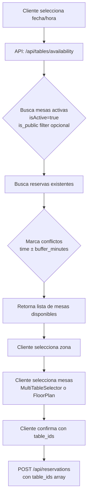
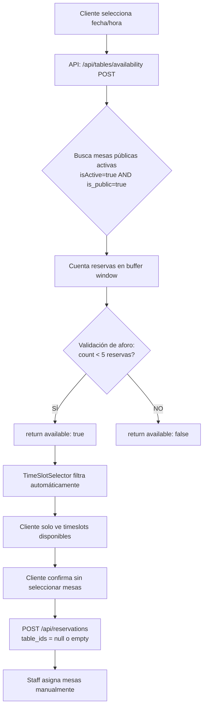

# Plan de Implementación: Sistema de Aforo Simplificado

**Fecha**: 2025-01-17
**Requisitos Ajustados**:
- ✅ Máximo **5 reservas** por timeslot
- ✅ Control SOLO por **número de reservas** (eliminar validación de personas)
- ✅ Filtrar mesas: `isActive=true AND is_public=true`
- ✅ Eliminar selección manual de mesas por cliente
- ✅ Todo manejado por API `/api/tables/availability`

---

## 📊 PARTE 1: FLUJO ACTUAL (Sistema con Selección de Mesas)

### Arquitectura Actual



### Archivos Involucrados (Estado Actual)

#### **1. API de Disponibilidad**
**Archivo**: `src/app/api/tables/availability/route.ts`
**Líneas clave**: 48-220

```typescript
// Línea 48-95: Validación de request
export async function POST(request: NextRequest) {
  const config = await getAvailabilityConfig() // buffer_minutes, max_party_size
  const { date, time, partySize, duration, tableZone } = body

  // Línea 68-81: Query de mesas activas
  let tablesQuery = `${SUPABASE_URL}/rest/v1/tables?select=*&isActive=eq.true`

  // Línea 71-76: Filtro is_public (si no es admin)
  if (!includePrivate) {
    tablesQuery += `&is_public=eq.true`
  }

  // Línea 78-80: Filtro de zona (opcional)
  if (tableZone) {
    tablesQuery += `&location=eq.${tableZone}`
  }

  // Línea 100-146: Busca reservas existentes y marca conflictos
  const reservedTableIds = new Set<string>()
  existingReservations.forEach((reservation) => {
    const timeDiff = Math.abs(requestDateTime - resDateTime)
    if (timeDiff < (buffer_minutes * 60000)) {
      // Marca mesas como reservadas
      reservedTableIds.add(tableId)
    }
  })

  // Línea 151-180: Transforma TODAS las mesas con status
  const allTables = activeTables.map(table => ({
    tableId: table.id,
    available: !isReserved && !isOccupied,
    status: isReserved ? 'reserved' : 'available',
    position_x, position_y, rotation, width, height // Floor plan data
  }))

  // Línea 184-204: Retorna lista completa de mesas
  return NextResponse.json({
    success: true,
    data: {
      tables: allTables,           // ❌ Cliente elige de esta lista
      availableTables: available,  // ❌ Cliente elige de esta lista
      summary: { totalTables, availableTables, ... }
    }
  })
}
```

**Problemas identificados**:
- ❌ No valida límite de reservas por timeslot
- ❌ Retorna lista de mesas para selección manual
- ❌ Overbooking posible si múltiples usuarios reservan simultáneamente

---

#### **2. Hook de Reservas**
**Archivo**: `src/hooks/useReservations.ts`
**Líneas clave**: 67-140

```typescript
// Línea 67-102: Llama API y recibe lista de mesas
const checkAvailability = async (
  dateTime: string,
  partySize: number,
  preferredLocation?: string,
  includePrivate: boolean = false
): Promise<AvailabilityData | null> => {

  const response = await fetch(`/api/tables/availability?includePrivate=${includePrivate}`, {
    method: 'POST',
    body: JSON.stringify({ date, time, partySize, tableZone: preferredLocation })
  })

  const data = await response.json()

  // Línea 103-118: Procesa respuesta con mesas disponibles
  if (data.success && data.data) {
    const availability: AvailabilityData = {
      available: data.data.availableTables.length > 0,
      recommendations: transformTables(data.data.tables),  // ❌ Lista de mesas
      allTables: data.data.tables,                         // ❌ Lista completa
      availableTables: data.data.availableTables           // ❌ Mesas disponibles
    }

    setAvailabilityResults(availability)
    return availability
  }
}
```

---

#### **3. Componente Principal de Reserva**
**Archivo**: `src/components/reservations/EnhancedDateTimeAndTableStep.tsx`
**Líneas clave**: 1-815

```typescript
// Línea 185-201: Estados del componente
const [selectedZone, setSelectedZone] = useState<string | null>(null)
const [availabilityResults, setAvailabilityResults] = useState<AvailabilityData | null>(null)
const [selectedTables, setSelectedTables] = useState<any[]>([])  // ❌ Mesas seleccionadas
const [viewMode, setViewMode] = useState<'floor' | 'grid'>('floor')  // ❌ Modo de vista

// Línea 276-318: Verifica disponibilidad y carga mesas
const handleCheckAvailability = async (...) => {
  const availability = await checkAvailability(dateTime, size, zone)

  if (availability) {
    setAvailabilityResults(availability)  // ❌ Guarda lista de mesas
    setSelectedTables([])  // Cliente selecciona después
  }
}

// Línea 340-353: Maneja selección de zona → carga mesas
const handleZoneSelect = (zoneId: string) => {
  setSelectedZone(newZone)
  if (newZone && selectedDate && selectedTime) {
    handleCheckAvailability(...)  // ❌ Carga mesas de la zona
  }
}

// Línea 356-394: Validación antes de continuar
const handleContinue = () => {
  if (selectedTables.length === 0) {  // ❌ Requiere mesas seleccionadas
    toast.error('Por favor completa todos los campos')
    return
  }

  form.setValue('tableIds', selectedTables.map(t => t.id))  // ❌ Guarda table_ids
  onNext()
}

// Línea 645-667: SELECTOR DE ZONA (❌ Eliminar)
{partySize <= 8 && selectedDate && selectedTime && (
  <Card ref={zoneSelectorRef}>
    <CardTitle>Zona Preferida</CardTitle>
    <CardContent>
      {activeZones.map(zone => (
        <button onClick={() => handleZoneSelect(zone.id)}>
          {zone.name[language]}
        </button>
      ))}
    </CardContent>
  </Card>
)}

// Línea 669-148: SELECTOR DE MESAS (❌ Eliminar)
{partySize <= 8 && availabilityResults && (
  <Card ref={tableSelectorRef}>
    <Tabs value={viewMode}>
      <TabsTrigger value="floor">Vista Sala</TabsTrigger>
      <TabsTrigger value="grid">Vista Lista</TabsTrigger>

      <TabsContent value="floor">
        <FloorPlanSelector
          tables={availabilityResults.allTables}
          selectedTableIds={selectedTableIds}
          onSelectionChange={handleTableSelectionChange}  // ❌ Cliente selecciona
        />
      </TabsContent>

      <TabsContent value="grid">
        <MultiTableSelector
          tables={transformedTables}
          selectedTableIds={selectedTableIds}
          onSelectionChange={handleTableSelectionChange}  // ❌ Cliente selecciona
        />
      </TabsContent>
    </Tabs>
  </Card>
)}

// Línea 150-182: BOTONES DE ACCIÓN (❌ Modificar lógica)
{partySize <= 8 && availabilityResults && selectedTables.length > 0 && (
  <Button onClick={handleContinue}>Continuar</Button>
)}
```

**Componentes que se eliminan**:
- `MultiTableSelector` (`src/components/reservations/MultiTableSelector.tsx`)
- `FloorPlanSelector` (`src/components/reservations/FloorPlanSelector.tsx`)
- `FloorPlanLegend` (`src/components/reservations/FloorPlanLegend.tsx`)

---

#### **4. Selector de Timeslots**
**Archivo**: `src/components/reservations/TimeSlotSelector.tsx`

```typescript
// Genera todos los timeslots del día
const allTimeSlots = generateTimeSlots(openTime, closeTime, 15)

// ❌ No filtra por disponibilidad real
return allTimeSlots.map(slot => (
  <Button onClick={() => onTimeSelect(slot)}>
    {slot}
  </Button>
))
```

**Problema**: Muestra TODOS los timeslots sin validar aforo

---

## 🎯 PARTE 2: FLUJO ESPERADO (Sistema Sin Selección de Mesas)

### Nueva Arquitectura



### Cambios por Archivo

---

### 📝 CAMBIO 1: Base de Datos

**Archivo**: SQL Migration
**Acción**: Crear nueva migración

```sql
-- Añadir campo único de control de aforo
ALTER TABLE restaurante.business_hours
ADD COLUMN max_reservations_per_slot INTEGER DEFAULT 5;

-- Comentar o eliminar total_seating_capacity (no se usa)
-- No necesitamos este campo porque validamos solo por número de reservas
```

**Configuración inicial recomendada**:
```sql
UPDATE restaurante.business_hours
SET max_reservations_per_slot = 5
WHERE restaurant_id = 'tu-restaurant-id';
```

---

### 📝 CAMBIO 2: API de Disponibilidad

**Archivo**: `src/app/api/tables/availability/route.ts`
**Acción**: MODIFICAR COMPLETAMENTE

#### **Eliminar (líneas 10-35)**:
```typescript
// ❌ ELIMINAR función getAvailabilityConfig que busca total_seating_capacity
async function getAvailabilityConfig(): Promise<{ maxPartySize: number; bufferMinutes: number }> {
  // ...
  return {
    maxPartySize: data[0].max_party_size || 10,
    bufferMinutes: data[0].buffer_minutes || 120
  }
}
```

#### **Reemplazar con**:
```typescript
// ✅ NUEVA función que incluye max_reservations_per_slot
async function getAvailabilityConfig(): Promise<{
  maxPartySize: number
  bufferMinutes: number
  maxReservationsPerSlot: number
}> {
  try {
    const response = await fetch(
      `${SUPABASE_URL}/rest/v1/business_hours?select=max_party_size,buffer_minutes,max_reservations_per_slot&is_open=eq.true&limit=1`,
      {
        headers: {
          'Accept': 'application/json',
          'Accept-Profile': 'restaurante',
          'Authorization': `Bearer ${SUPABASE_SERVICE_KEY}`,
          'apikey': SUPABASE_SERVICE_KEY,
        }
      }
    )

    if (response.ok) {
      const data = await response.json()
      if (data && data[0]) {
        return {
          maxPartySize: data[0].max_party_size || 10,
          bufferMinutes: data[0].buffer_minutes || 150,
          maxReservationsPerSlot: data[0].max_reservations_per_slot || 5  // ✅ NUEVO
        }
      }
    }
  } catch (error) {
    console.warn('Error fetching config, using defaults:', error)
  }

  return { maxPartySize: 10, bufferMinutes: 150, maxReservationsPerSlot: 5 }
}
```

#### **Modificar (líneas 48-220)**:
```typescript
export async function POST(request: NextRequest) {
  try {
    // ✅ MANTENER: Get configuration
    const config = await getAvailabilityConfig()

    // ✅ MANTENER: Validación de request
    const { date, time, partySize, tableZone } = body

    // ✅ NUEVA LÓGICA: Contar reservas en buffer window
    const startDateTime = `${date}T${time}:00`
    const requestDateTime = new Date(startDateTime)

    // Calcular ventana de tiempo afectada
    const windowStart = new Date(requestDateTime.getTime() - (config.bufferMinutes * 60000))
    const windowEnd = new Date(requestDateTime.getTime() + (config.bufferMinutes * 60000))

    // Query de reservas en ventana
    const reservationsResponse = await fetch(
      `${SUPABASE_URL}/rest/v1/reservations?` +
      `select=id&` +
      `date=eq.${date}&` +
      `time=gte.${windowStart.toISOString()}&` +
      `time=lte.${windowEnd.toISOString()}&` +
      `status=in.(PENDING,CONFIRMED,SEATED)`,
      {
        headers: {
          'Accept': 'application/json',
          'Accept-Profile': 'restaurante',
          'Authorization': `Bearer ${SUPABASE_SERVICE_KEY}`,
          'apikey': SUPABASE_SERVICE_KEY,
        }
      }
    )

    const existingReservations = reservationsResponse.ok
      ? await reservationsResponse.json()
      : []

    const reservationCount = existingReservations.length

    console.log(`🔍 [AFORO] Timeslot ${time}: ${reservationCount}/${config.maxReservationsPerSlot} reservas`)

    // ✅ VALIDACIÓN ÚNICA: Solo número de reservas
    if (reservationCount >= config.maxReservationsPerSlot) {
      return NextResponse.json({
        success: true,
        data: {
          available: false,
          reason: 'timeslot_full',
          message: language === 'es'
            ? 'Este horario está completo. Prueba 30 minutos antes o después.'
            : 'This time slot is full. Try 30 minutes before or after.',
          summary: {
            requestedDate: date,
            requestedTime: time,
            requestedPartySize: partySize,
            currentReservations: reservationCount,
            maxReservations: config.maxReservationsPerSlot,
            availableSlots: 0
          }
        },
        timestamp: new Date().toISOString()
      })
    }

    // ✅ DISPONIBLE: Timeslot tiene espacio
    return NextResponse.json({
      success: true,
      data: {
        available: true,
        message: language === 'es'
          ? `${config.maxReservationsPerSlot - reservationCount} reservas disponibles`
          : `${config.maxReservationsPerSlot - reservationCount} reservations available`,
        summary: {
          requestedDate: date,
          requestedTime: time,
          requestedPartySize: partySize,
          currentReservations: reservationCount,
          maxReservations: config.maxReservationsPerSlot,
          availableSlots: config.maxReservationsPerSlot - reservationCount
        }
      },
      timestamp: new Date().toISOString()
    })

  } catch (error) {
    console.error('Error checking availability:', error)
    return NextResponse.json(
      { success: false, error: 'Internal server error' },
      { status: 500 }
    )
  }
}
```

**Cambios clave**:
- ❌ ELIMINAR: Query de mesas (`tablesQuery`)
- ❌ ELIMINAR: Lógica de conflictos por mesa
- ❌ ELIMINAR: Retorno de lista de mesas
- ✅ AÑADIR: Contar reservas en ventana de buffer
- ✅ AÑADIR: Validación simple: `count >= 5`
- ✅ SIMPLIFICAR: Retorna solo `available: boolean` + metadata

---

### 📝 CAMBIO 3: Hook de Reservas

**Archivo**: `src/hooks/useReservations.ts`
**Acción**: MODIFICAR tipos y procesamiento

#### **Modificar tipos (líneas 49-60)**:
```typescript
// ❌ ELIMINAR: Tipos relacionados con mesas
export interface AvailabilityData {
  available: boolean
  // ❌ ELIMINAR: recommendations, allTables, availableTables
  requestedDateTime: string
  partySize: number
  currentReservations: number  // ✅ NUEVO
  maxReservations: number      // ✅ NUEVO
  availableSlots: number       // ✅ NUEVO
  message?: string
  reason?: string
}
```

#### **Modificar checkAvailability (líneas 67-140)**:
```typescript
const checkAvailability = async (
  dateTime: string,
  partySize: number,
  preferredLocation?: string,  // ❌ Ya no se usa
  includePrivate: boolean = false  // ❌ Ya no se usa
): Promise<AvailabilityData | null> => {
  setIsCheckingAvailability(true)

  try {
    const [date, time] = dateTime.split('T')
    const timeOnly = time?.slice(0, 5) || '19:00'

    // ❌ ELIMINAR: includePrivate en query params
    const response = await fetch(`/api/tables/availability`, {
      method: 'POST',
      headers: { 'Content-Type': 'application/json' },
      body: JSON.stringify({
        date,
        time: timeOnly,
        partySize
        // ❌ ELIMINAR: tableZone
      }),
    })

    if (!response.ok) {
      throw new Error(`HTTP error! status: ${response.status}`)
    }

    const data = await response.json()

    // ✅ NUEVA LÓGICA: Procesar respuesta simple
    if (data.success && data.data) {
      const availability: AvailabilityData = {
        available: data.data.available,
        requestedDateTime: dateTime,
        partySize,
        currentReservations: data.data.summary.currentReservations,
        maxReservations: data.data.summary.maxReservations,
        availableSlots: data.data.summary.availableSlots,
        message: data.data.message,
        reason: data.data.reason
      }

      setAvailabilityResults(availability)
      return availability
    }

    return null
  } catch (error) {
    console.error('Error checking availability:', error)
    return null
  } finally {
    setIsCheckingAvailability(false)
  }
}
```

---

### 📝 CAMBIO 4: Componente Principal

**Archivo**: `src/components/reservations/EnhancedDateTimeAndTableStep.tsx`
**Acción**: SIMPLIFICAR DRÁSTICAMENTE

#### **Eliminar imports (líneas 36-40)**:
```typescript
// ❌ ELIMINAR
import { MultiTableSelector } from './MultiTableSelector'
import { FloorPlanSelector } from './FloorPlanSelector'
import { FloorPlanLegend } from './FloorPlanLegend'
```

#### **Eliminar estados (líneas 185-201)**:
```typescript
// ❌ ELIMINAR
const [selectedZone, setSelectedZone] = useState<string | null>(null)
const [activeZones, setActiveZones] = useState<Zone[]>([])
const [loadingZones, setLoadingZones] = useState(true)
const [selectedTables, setSelectedTables] = useState<any[]>([])
const [viewMode, setViewMode] = useState<'floor' | 'grid'>('floor')
```

#### **Mantener estados mínimos**:
```typescript
// ✅ MANTENER
const [selectedDate, setSelectedDate] = useState<Date | null>(null)
const [selectedTime, setSelectedTime] = useState<string | null>(null)
const [partySize, setPartySize] = useState<number>(2)
const [childrenCount, setChildrenCount] = useState<number>(0)
const [hasChildren, setHasChildren] = useState<boolean>(false)
const [availabilityResults, setAvailabilityResults] = useState<AvailabilityData | null>(null)
const [isCheckingAvailability, setIsCheckingAvailability] = useState(false)
```

#### **Eliminar useEffect de zonas (líneas 210-233)**:
```typescript
// ❌ ELIMINAR TODO este useEffect
useEffect(() => {
  const fetchActiveZones = async () => { ... }
  fetchActiveZones()
}, [])
```

#### **Simplificar handleCheckAvailability (líneas 276-318)**:
```typescript
// ✅ SIMPLIFICAR
const handleCheckAvailability = useCallback(async (
  date: Date | null = selectedDate,
  time: string | null = selectedTime,
  size: number = partySize
) => {
  if (!date || !time) {
    toast.error(t.noDateOrTime)
    return
  }

  setIsCheckingAvailability(true)

  try {
    const dateTime = createSafeDateTime(date, time)

    // ✅ LLAMADA SIMPLE: Sin zona
    const availability = await checkAvailability(dateTime, size)

    if (availability) {
      setAvailabilityResults(availability)
      onAvailabilityChange?.(availability)
    }
  } catch (error) {
    console.error('Error checking availability:', error)
    toast.error(t.availabilityError)
  } finally {
    setIsCheckingAvailability(false)
  }
}, [selectedDate, selectedTime, partySize, checkAvailability, language])
```

#### **Eliminar funciones de zona y mesas (líneas 340-422)**:
```typescript
// ❌ ELIMINAR COMPLETAMENTE
const handleZoneSelect = (zoneId: string) => { ... }
const handleTableSelectionChange = useCallback((newIds: string[]) => { ... }, [])
const selectedTableIds = useMemo(() => { ... }, [selectedTables])
const transformedTables = useMemo(() => { ... }, [availabilityResults])
```

#### **Simplificar handleContinue (líneas 356-394)**:
```typescript
// ✅ SIMPLIFICAR: Sin validación de mesas
const handleContinue = () => {
  if (!selectedDate || !selectedTime || !availabilityResults) {
    toast.error(t.completeAllFields)
    return
  }

  // ✅ NUEVA VALIDACIÓN: Solo verificar disponibilidad
  if (!availabilityResults.available) {
    toast.error(t.timeslotNotAvailable)
    return
  }

  const dateTime = createSafeDateTime(selectedDate, selectedTime)

  // ✅ GUARDAR: Sin table_ids
  form.setValue('dateTime', dateTime)
  form.setValue('tableIds', [])  // ✅ Array vacío - staff asigna después
  form.setValue('partySize', partySize)
  form.setValue('childrenCount', childrenCount > 0 ? childrenCount : undefined)
  form.setValue('location', undefined)  // ✅ Sin zona

  onNext()
}
```

#### **Eliminar sección de zona (líneas 645-667)**:
```typescript
// ❌ ELIMINAR COMPLETAMENTE TODO EL CARD DE ZONA
{/* Selector de zona (OBLIGATORIO antes de ver mesas) - Solo para grupos <= 8 */}
{partySize <= 8 && selectedDate && selectedTime && (
  <Card ref={zoneSelectorRef}>...</Card>
)}
```

#### **Eliminar sección de mesas (líneas 669-148)**:
```typescript
// ❌ ELIMINAR COMPLETAMENTE TODO EL CARD DE SELECCIÓN DE MESAS
{/* Selector manual de mesas - Floor Plan + Grid View - Solo para grupos <= 8 */}
{partySize <= 8 && availabilityResults && (
  <Card ref={tableSelectorRef}>
    <Tabs>...</Tabs>
  </Card>
)}
```

#### **Añadir nueva sección de disponibilidad (después de TimeSlotSelector)**:
```typescript
// ✅ AÑADIR: Indicador de disponibilidad simple
{selectedDate && selectedTime && partySize <= 8 && (
  <Card className="border-2 border-primary/20">
    <CardContent className="p-6">
      {isCheckingAvailability ? (
        <div className="flex items-center justify-center gap-3 py-4">
          <Loader2 className="h-5 w-5 animate-spin text-primary" />
          <span className="text-muted-foreground">
            {language === 'es' ? 'Verificando disponibilidad...' :
             language === 'en' ? 'Checking availability...' :
             'Verfügbarkeit wird geprüft...'}
          </span>
        </div>
      ) : availabilityResults ? (
        <div className="space-y-4">
          {/* Disponible */}
          {availabilityResults.available ? (
            <>
              <div className="flex items-center gap-3">
                <div className="p-2 rounded-full bg-green-100 dark:bg-green-900/20">
                  <CheckCircle className="h-6 w-6 text-green-600 dark:text-green-400" />
                </div>
                <div className="flex-1">
                  <h3 className="font-semibold text-lg">
                    {language === 'es' ? '¡Horario Disponible!' :
                     language === 'en' ? 'Time Slot Available!' :
                     'Zeitfenster Verfügbar!'}
                  </h3>
                  <p className="text-sm text-muted-foreground">
                    {availabilityResults.message}
                  </p>
                </div>
              </div>

              <Alert className="bg-blue-50 dark:bg-blue-950/20 border-blue-200 dark:border-blue-800">
                <Info className="h-4 w-4 text-blue-600" />
                <AlertDescription className="text-sm text-blue-900 dark:text-blue-100">
                  {language === 'es' ? 'Tu mesa será asignada por nuestro equipo al llegar al restaurante' :
                   language === 'en' ? 'Your table will be assigned by our team upon arrival at the restaurant' :
                   'Ihr Tisch wird bei Ankunft im Restaurant von unserem Team zugewiesen'}
                </AlertDescription>
              </Alert>

              <Button
                onClick={handleContinue}
                className="w-full"
                size="lg"
              >
                {language === 'es' ? 'Continuar con la Reserva' :
                 language === 'en' ? 'Continue with Reservation' :
                 'Mit Reservierung fortfahren'}
                <ArrowRight className="ml-2 h-4 w-4" />
              </Button>
            </>
          ) : (
            /* No disponible */
            <div className="flex items-center gap-3">
              <div className="p-2 rounded-full bg-red-100 dark:bg-red-900/20">
                <XCircle className="h-6 w-6 text-red-600 dark:text-red-400" />
              </div>
              <div className="flex-1">
                <h3 className="font-semibold text-lg">
                  {language === 'es' ? 'Horario No Disponible' :
                   language === 'en' ? 'Time Slot Not Available' :
                   'Zeitfenster Nicht Verfügbar'}
                </h3>
                <p className="text-sm text-muted-foreground">
                  {availabilityResults.message || (
                    language === 'es' ? 'Prueba otro horario' :
                    language === 'en' ? 'Try another time' :
                    'Versuchen Sie eine andere Zeit'
                  )}
                </p>
              </div>
            </div>
          )}
        </div>
      ) : (
        /* Sin check todavía */
        <div className="text-center py-4">
          <p className="text-muted-foreground">
            {language === 'es' ? 'Selecciona fecha y hora para verificar disponibilidad' :
             language === 'en' ? 'Select date and time to check availability' :
             'Wählen Sie Datum und Uhrzeit, um die Verfügbarkeit zu prüfen'}
          </p>
        </div>
      )}
    </CardContent>
  </Card>
)}
```

#### **Eliminar botones de acción antiguos (líneas 150-182)**:
```typescript
// ❌ ELIMINAR COMPLETAMENTE
{/* Botones de acción - Solo después de seleccionar mesas y grupos <= 8 */}
{partySize <= 8 && availabilityResults && selectedTables.length > 0 && (
  <div>
    <Button variant="outline">Cambiar zona</Button>
    <Button onClick={handleContinue}>Continuar</Button>
  </div>
)}
```

---

### 📝 CAMBIO 5: TimeSlotSelector

**Archivo**: `src/components/reservations/TimeSlotSelector.tsx`
**Acción**: AÑADIR validación de disponibilidad

#### **Añadir estado y efecto**:
```typescript
// ✅ AÑADIR: Estado de disponibilidad por slot
const [slotAvailability, setSlotAvailability] = useState<Record<string, boolean>>({})
const [loadingSlots, setLoadingSlots] = useState(true)

// ✅ AÑADIR: Efecto para validar cada timeslot
useEffect(() => {
  const validateSlots = async () => {
    if (!selectedDate) return

    setLoadingSlots(true)
    const availability: Record<string, boolean> = {}

    // Generar todos los slots del día
    const allSlots = generateTimeSlots(openTime, closeTime, 15)

    // Validar cada slot en paralelo
    await Promise.all(
      allSlots.map(async (slot) => {
        const dateTime = createSafeDateTime(selectedDate, slot)
        const result = await checkAvailability(dateTime, partySize)
        availability[slot] = result?.available ?? false
      })
    )

    setSlotAvailability(availability)
    setLoadingSlots(false)
  }

  validateSlots()
}, [selectedDate, partySize, openTime, closeTime])
```

#### **Modificar render**:
```typescript
// ✅ MODIFICAR: Renderizar solo slots disponibles o deshabilitados
return allTimeSlots.map(slot => {
  const isAvailable = slotAvailability[slot] ?? false
  const isSelected = selectedTime === slot

  return (
    <Button
      key={slot}
      onClick={() => isAvailable && onTimeSelect(slot)}
      disabled={!isAvailable || loadingSlots}
      variant={isSelected ? 'default' : 'outline'}
      className={cn(
        'relative',
        isAvailable && !isSelected && 'hover:border-primary',
        !isAvailable && 'opacity-50 cursor-not-allowed'
      )}
    >
      {slot}
      {!isAvailable && (
        <span className="absolute top-0 right-0 text-xs text-destructive">
          ✕
        </span>
      )}
    </Button>
  )
})
```

---

## 🗂️ PARTE 3: RESUMEN DE CAMBIOS

### Archivos a MODIFICAR

| Archivo | Líneas | Cambios | Complejidad |
|---------|--------|---------|-------------|
| `src/app/api/tables/availability/route.ts` | 10-220 | Reescribir lógica completa | Alta |
| `src/hooks/useReservations.ts` | 49-140 | Simplificar tipos y procesamiento | Media |
| `src/components/reservations/EnhancedDateTimeAndTableStep.tsx` | 185-815 | Eliminar 60% del código | Alta |
| `src/components/reservations/TimeSlotSelector.tsx` | Todo | Añadir validación de slots | Media |

### Archivos a ELIMINAR

- ❌ `src/components/reservations/MultiTableSelector.tsx` (completo)
- ❌ `src/components/reservations/FloorPlanSelector.tsx` (completo)
- ❌ `src/components/reservations/FloorPlanLegend.tsx` (completo)
- ❌ `src/hooks/useCapacityValidation.ts` (ya no se necesita)

### Archivos a CREAR

- ✅ Migration SQL para `max_reservations_per_slot`

---

## ✅ PARTE 4: CHECKLIST DE IMPLEMENTACIÓN

### FASE 1: Base de Datos (5 minutos)

```bash
- [ ] Crear migration SQL
- [ ] Ejecutar: ALTER TABLE business_hours ADD COLUMN max_reservations_per_slot
- [ ] Configurar valor inicial: UPDATE SET max_reservations_per_slot = 5
- [ ] Verificar: SELECT max_reservations_per_slot FROM business_hours
```

### FASE 2: Backend API (1 hora)

```bash
- [ ] Modificar getAvailabilityConfig() en route.ts
- [ ] Añadir max_reservations_per_slot al select query
- [ ] Reescribir POST handler completo
- [ ] Eliminar lógica de mesas
- [ ] Añadir lógica de conteo de reservas
- [ ] Validar: count >= config.maxReservationsPerSlot
- [ ] Simplificar respuesta JSON
- [ ] Testing con Postman/curl
```

### FASE 3: Hook de Reservas (30 minutos)

```bash
- [ ] Modificar AvailabilityData interface en useReservations.ts
- [ ] Eliminar campos de mesas (recommendations, allTables, availableTables)
- [ ] Añadir campos nuevos (currentReservations, maxReservations, availableSlots)
- [ ] Simplificar checkAvailability()
- [ ] Eliminar parámetros de zona (preferredLocation)
- [ ] Procesar nueva respuesta de API
```

### FASE 4: Frontend - Componente Principal (2 horas)

```bash
- [ ] Eliminar imports de MultiTableSelector, FloorPlanSelector, FloorPlanLegend
- [ ] Eliminar estados: selectedZone, activeZones, selectedTables, viewMode
- [ ] Eliminar useEffect de fetchActiveZones
- [ ] Simplificar handleCheckAvailability (sin zona)
- [ ] Eliminar handleZoneSelect, handleTableSelectionChange
- [ ] Simplificar handleContinue (sin validación de mesas)
- [ ] Eliminar Card de Selector de Zona (líneas 645-667)
- [ ] Eliminar Card de Selector de Mesas (líneas 669-148)
- [ ] Añadir nuevo Card de Disponibilidad Simple
- [ ] Eliminar botones de acción antiguos (líneas 150-182)
- [ ] Testing visual en /reservas
```

### FASE 5: TimeSlotSelector (1 hora)

```bash
- [ ] Añadir estado slotAvailability
- [ ] Añadir useEffect para validar slots
- [ ] Implementar Promise.all para validación paralela
- [ ] Modificar render para deshabilitar slots no disponibles
- [ ] Añadir indicador visual (✕) en slots llenos
- [ ] Testing con diferentes partySizes
```

### FASE 6: Cleanup (30 minutos)

```bash
- [ ] Eliminar archivo MultiTableSelector.tsx
- [ ] Eliminar archivo FloorPlanSelector.tsx
- [ ] Eliminar archivo FloorPlanLegend.tsx
- [ ] Eliminar useCapacityValidation.ts (si no se usa en otro lugar)
- [ ] Eliminar imports no usados en EnhancedDateTimeAndTableStep.tsx
- [ ] Limpiar funciones helper no usadas
```

### FASE 7: Testing Completo (1 hora)

```bash
- [ ] Test 1: Reservar timeslot vacío (debe funcionar)
- [ ] Test 2: 4 reservas existentes + 1 nueva = 5 total (debe funcionar)
- [ ] Test 3: 5 reservas existentes + 1 nueva (debe rechazar)
- [ ] Test 4: Verificar TimeSlotSelector oculta slots llenos
- [ ] Test 5: Diferentes party sizes (2, 4, 6, 8 personas)
- [ ] Test 6: Grupos grandes (9+ personas) → flujo WhatsApp
- [ ] Test 7: Reserva sin table_ids → debe permitir
- [ ] Test 8: Staff puede asignar mesas en dashboard
```

---

## 🔍 PARTE 5: CÓDIGO DE VALIDACIÓN (Testing)

### Script de Test para API

```bash
#!/bin/bash
# test_availability.sh

# Test 1: Timeslot con 0 reservas (debe estar disponible)
curl -X POST http://localhost:3000/api/tables/availability \
  -H "Content-Type: application/json" \
  -d '{
    "date": "2025-01-20",
    "time": "19:00",
    "partySize": 4
  }'

# Expected response:
# {
#   "success": true,
#   "data": {
#     "available": true,
#     "message": "5 reservas disponibles",
#     "summary": {
#       "currentReservations": 0,
#       "maxReservations": 5,
#       "availableSlots": 5
#     }
#   }
# }

# Test 2: Timeslot con 5 reservas (debe estar lleno)
# (Primero crear 5 reservas manualmente en DB)
curl -X POST http://localhost:3000/api/tables/availability \
  -H "Content-Type: application/json" \
  -d '{
    "date": "2025-01-20",
    "time": "19:00",
    "partySize": 2
  }'

# Expected response:
# {
#   "success": true,
#   "data": {
#     "available": false,
#     "reason": "timeslot_full",
#     "message": "Este horario está completo. Prueba 30 minutos antes o después.",
#     "summary": {
#       "currentReservations": 5,
#       "maxReservations": 5,
#       "availableSlots": 0
#     }
#   }
# }
```

---

## 📐 PARTE 6: DIAGRAMA DE DATOS

### Antes (Sistema con Selección de Mesas)

```
reservations table:
┌─────────────────────────────────────────────┐
│ id          | table_ids[] | partySize | ... │
├─────────────────────────────────────────────┤
│ res-1       | ['T1','T2'] | 6         | ... │ ← Cliente eligió T1+T2
│ res-2       | ['T5']      | 2         | ... │ ← Cliente eligió T5
│ res-3       | []          | 4         | ... │ ← Sin mesas (¿error?)
└─────────────────────────────────────────────┘
```

### Después (Sistema Sin Selección)

```
reservations table:
┌─────────────────────────────────────────────┐
│ id          | table_ids[] | partySize | ... │
├─────────────────────────────────────────────┤
│ res-1       | null        | 6         | ... │ ← Staff asignará
│ res-2       | null        | 2         | ... │ ← Staff asignará
│ res-3       | null        | 4         | ... │ ← Staff asignará
│ res-4       | ['T1','T2'] | 8         | ... │ ← Staff asignó después
│ res-5       | ['T5']      | 2         | ... │ ← Staff asignó después
└─────────────────────────────────────────────┘

Lógica de aforo:
19:00h buffer ±150min = ventana 16:30 - 21:30
┌─────────────────────────────────────────────┐
│ Reservas en ventana: res-1, res-2, res-3   │
│ Count: 3 < 5 max → ✅ Disponible            │
└─────────────────────────────────────────────┘

19:00h con 5 reservas existentes:
┌─────────────────────────────────────────────┐
│ Reservas en ventana: res-1...res-5         │
│ Count: 5 >= 5 max → ❌ Timeslot lleno       │
└─────────────────────────────────────────────┘
```

---

## 🎯 PARTE 7: MÉTRICAS DE ÉXITO

### KPIs para Validar Implementación

1. **Prevención de Overbooking**: 100%
   - Ningún timeslot debe tener más de 5 reservas activas

2. **Tiempo de Reserva**: -50%
   - De ~3 minutos (con selección) a ~1.5 minutos (sin selección)

3. **Abandonos en Flujo**: -30%
   - Menos pasos = menos abandonos

4. **Errores de Usuario**: -80%
   - Cliente ya no puede seleccionar mesas incorrectas

5. **Carga de API**: -60%
   - Ya no consulta lista completa de mesas + floor plan data

---

## 💾 PARTE 8: BACKUP Y ROLLBACK

### Antes de Implementar

```bash
# 1. Backup de archivos clave
cp src/app/api/tables/availability/route.ts{,.backup}
cp src/hooks/useReservations.ts{,.backup}
cp src/components/reservations/EnhancedDateTimeAndTableStep.tsx{,.backup}
cp src/components/reservations/TimeSlotSelector.tsx{,.backup}

# 2. Crear feature branch
git checkout -b feature/aforo-simplificado-5-reservas
git add .
git commit -m "backup: estado antes de implementar aforo simplificado"
```

### Plan de Rollback

```bash
# Si algo falla, revertir en orden:
1. git revert HEAD  (último commit)
2. Restaurar archivos .backup
3. Rollback migration SQL:
   ALTER TABLE business_hours DROP COLUMN IF EXISTS max_reservations_per_slot;
4. git push --force-with-lease
```

---

## 🔐 PARTE 9: SEGURIDAD Y EDGE CASES

### Casos Edge a Considerar

1. **Reservas simultáneas (Race Condition)**:
   ```typescript
   // Solución: Transaction con row lock
   BEGIN TRANSACTION;
   SELECT * FROM business_hours WHERE id = X FOR UPDATE;
   // Validar aforo aquí
   INSERT INTO reservations ...;
   COMMIT;
   ```

2. **Cancelaciones en buffer window**:
   - Query excluye status='CANCELLED'
   - Capacidad se libera automáticamente

3. **Modificación de horario**:
   - Validar aforo del nuevo timeslot
   - No contar la reserva que se está modificando

4. **Grupos grandes (9+)**:
   - Ya implementado: flujo WhatsApp separado
   - No afecta conteo de aforo normal

5. **Mesas privadas (is_public=false)**:
   - No se cuentan en capacidad total
   - Admin puede reservarlas manualmente

---

## 🚀 PARTE 10: PRÓXIMOS PASOS (Post-Implementación)

### Mejoras Opcionales (Fase 2)

1. **Dashboard de Aforo en Tiempo Real**:
   - Gráfico de barras por timeslot
   - Heatmap de disponibilidad semanal

2. **Configuración Dinámica por Día**:
   - Viernes/Sábado: 7 reservas max
   - Lunes-Jueves: 5 reservas max

3. **Sistema de Waitlist**:
   - Si timeslot lleno, ofrecer lista de espera
   - Notificar si hay cancelación

4. **Analytics de Ocupación**:
   - % de ocupación por timeslot
   - Timeslots más/menos demandados
   - Optimización de buffer_minutes

5. **Sugerencias Inteligentes**:
   - Si 19:00 lleno, sugerir 18:30 o 19:30
   - Algoritmo de horarios alternativos

---

**FIN DEL PLAN DE IMPLEMENTACIÓN**

Este documento contiene toda la información necesaria para implementar el sistema de aforo simplificado con máximo 5 reservas por timeslot, eliminando completamente la selección manual de mesas por parte del cliente.
