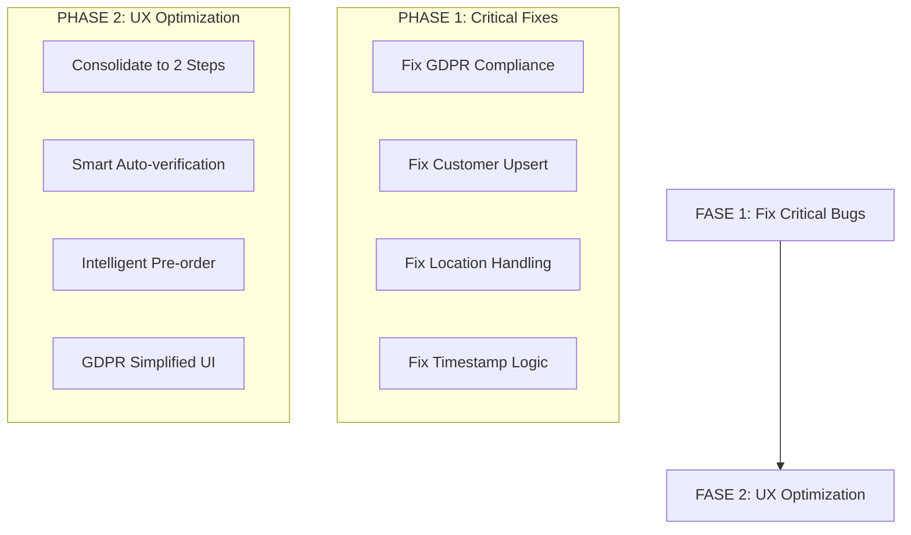
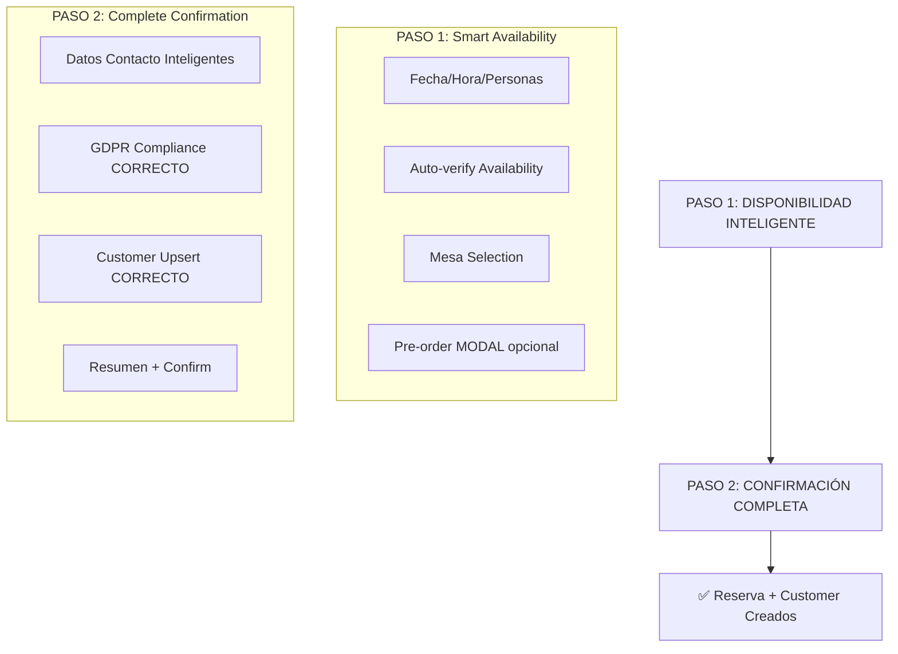

# RESERVATIONS PLUS: PLAN CORREGIDO BASADO EN ANÁLISIS DB REAL

> **❌ PLAN ANTERIOR DESCARTADO**: Basado en especulaciones sin análisis real de DB**
> **✅ PLAN NUEVO**: Basado en análisis exhaustivo de PostgreSQL + codebase actual**

---

## 🚨 BUGS CRÍTICOS IDENTIFICADOS EN SISTEMA ACTUAL

### 1. **BUG CRÍTICO: GDPR No Se Está Guardando Correctamente**

**Evidencia de DB Real:**
```sql
-- Reserva real en DB - TODOS los campos GDPR están FALSE
dataProcessingConsent = false
emailConsent = false
marketingConsent = false
consentDataProcessing = false
consentEmail = false
consentMarketing = false
-- Todos los timestamps GDPR están NULL
```

**Problema:** Campos GDPR duplicados en tabla `reservations` pero solo se populan los simples, los avanzados quedan vacíos.

**Campos GDPR en DB:**
```sql
-- Campos simples (SÍ se usan)
dataProcessingConsent BOOLEAN
emailConsent BOOLEAN
marketingConsent BOOLEAN

-- Campos avanzados (NO se usan - BUG)
consentDataProcessing BOOLEAN
consentDataProcessingTimestamp TIMESTAMPTZ
consentEmail BOOLEAN
consentEmailTimestamp TIMESTAMPTZ
consentMarketing BOOLEAN
consentMarketingTimestamp TIMESTAMPTZ
consentIpAddress INET
consentUserAgent TEXT
consentWithdrawnAt TIMESTAMPTZ
consentWithdrawalReason TEXT
gdprPolicyVersion TEXT DEFAULT 'v1.0'
consentMethod TEXT DEFAULT 'web_form'
```

### 2. **BUG CRÍTICO: Customer Upsert No Se Ejecuta**

**Evidencia de DB Real:**
```sql
-- Reserva real tiene customerId = NULL
customerId = (empty)
```

**Problema:** Existe código sofisticado `customer-upsert.ts` pero no se ejecuta en el flujo de reservas.

**Código Existente NO Ejecutado:**
```typescript
// src/lib/customer-upsert.ts - EXISTE pero NO SE USA
export async function upsertCustomer(rawData: CustomerUpsertData): Promise<UpsertResult>
export function extractCustomerDataFromReservation(reservationData: any): CustomerUpsertData
```

### 3. **INCONSISTENCIA: Solo 4 de 7 Locations Activas**

**Enum en DB (7 valores):**
```sql
TableLocation: TERRACE | INTERIOR | BAR | TERRACE_CAMPANARI | SALA_VIP | SALA_PRINCIPAL | TERRACE_JUSTICIA
```

**Locations Realmente Usadas (4 valores):**
```sql
TERRACE_CAMPANARI: 14 mesas
SALA_VIP: 3 mesas
SALA_PRINCIPAL: 8 mesas
TERRACE_JUSTICIA: 9 mesas
-- TERRACE, INTERIOR, BAR = 0 mesas
```

### 4. **CONFUSIÓN: Timestamps Duplicados**

**Campo Real en DB:**
```sql
date: 2025-09-20 19:15:00 (timestamp)
time: 2025-09-20 19:15:00 (timestamp) -- MISMO VALOR
```

**Código Asume:** Date string + Time string separados, pero DB almacena timestamps duplicados.

---

## 🎯 PLAN CORREGIDO: OPTIMIZACIÓN 2-PASOS + FIXING BUGS

### OBJETIVO PRINCIPAL
1. **ARREGLAR bugs críticos actuales**
2. **OPTIMIZAR UX** de 4 pasos → 2 pasos
3. **MANTENER compatibilidad** 100% con DB/APIs existentes

### ENFOQUE: Fix First, Optimize Second


---

## 🔧 FASE 1: CRITICAL BUGS FIXING

### 1.1 Fix GDPR Compliance (CRÍTICO)

**Problema:** Campos GDPR avanzados no se populan.

**Solución:** Actualizar API de reservaciones para poblar TODOS los campos GDPR.

```typescript
// src/app/api/reservations/route.ts - CORREGIR
export async function POST(request: NextRequest) {
  // ... código existente ...

  // 🚀 FIX: Poblar AMBOS sets de campos GDPR
  const now = new Date().toISOString()
  const clientIP = request.headers.get('x-forwarded-for') || request.headers.get('x-real-ip')
  const userAgent = request.headers.get('user-agent')

  const reservationPayload = {
    // ... campos existentes ...

    // ✅ Campos simples (YA FUNCIONAN)
    dataProcessingConsent: data.dataProcessingConsent,
    emailConsent: data.emailConsent,
    marketingConsent: data.marketingConsent,

    // 🚀 FIX: Campos avanzados (NO FUNCIONABAN)
    consentDataProcessing: data.dataProcessingConsent,
    consentDataProcessingTimestamp: data.dataProcessingConsent ? now : null,
    consentEmail: data.emailConsent,
    consentEmailTimestamp: data.emailConsent ? now : null,
    consentMarketing: data.marketingConsent,
    consentMarketingTimestamp: data.marketingConsent ? now : null,
    consentIpAddress: clientIP,
    consentUserAgent: userAgent,
    gdprPolicyVersion: 'v1.0',
    consentMethod: 'web_form'
  }
}
```

### 1.2 Fix Customer Upsert (CRÍTICO)

**Problema:** Customer upsert existe pero no se ejecuta.

**Solución:** Integrar customer-upsert en API de reservaciones.

```typescript
// src/app/api/reservations/route.ts - INTEGRAR UPSERT
export async function POST(request: NextRequest) {
  try {
    // ... validación existente ...

    // 🚀 FIX: EJECUTAR customer upsert (ACTUALMENTE NO SE HACE)
    const customerData = extractCustomerDataFromReservation(data, {
      ipAddress: request.headers.get('x-forwarded-for') || request.headers.get('x-real-ip'),
      userAgent: request.headers.get('user-agent'),
      timestamp: new Date().toISOString()
    })

    const { customerId, isNewCustomer } = await upsertCustomer(customerData)

    const reservationPayload = {
      // ... campos existentes ...
      customerId: customerId,  // 🚀 FIX: LINK customer (ACTUALMENTE NULL)
      // ... resto de campos ...
    }
  }
}
```

### 1.3 Fix Location Handling

**Problema:** Código asume 7 locations, realidad usa 4.

**Solución:** API dinámico que solo devuelve locations activas.

```typescript
// src/app/api/zones/active/route.ts - CREAR NUEVO ENDPOINT
export async function GET() {
  // Query only locations with active tables
  const activeLocations = await supabase
    .schema('restaurante')
    .from('tables')
    .select('location')
    .eq('isActive', true)
    .group('location')

  // Transform to UI format
  const zones = activeLocations.map(loc => ({
    id: loc.location,
    name: getLocationDisplayName(loc.location),
    type: getLocationType(loc.location),
    description: getLocationDescription(loc.location)
  }))

  return { success: true, data: { zones } }
}
```

### 1.4 Fix Timestamp Logic

**Problema:** Código separa date/time, DB almacena timestamps duplicados.

**Solución:** Corregir transformación de datos.

```typescript
// src/hooks/useReservations.ts - CORREGIR
const createReservation = async (data: ReservationData) => {
  // 🚀 FIX: Crear timestamp único, no date/time separados
  const reservationDateTime = new Date(`${data.date}T${data.time}:00`)

  const apiData = {
    // ... otros campos ...
    date: reservationDateTime,     // 🚀 FIX: MISMO timestamp
    time: reservationDateTime,     // 🚀 FIX: MISMO timestamp (no separado)
    // ... resto de campos ...
  }
}
```

---

## 🎨 FASE 2: UX OPTIMIZATION (DESPUÉS DE FIXES)

### 2.1 Nuevo Flujo 2-Pasos (Post-Fixes)



### 2.2 Componentes Corregidos

#### A. SmartAvailabilityStep.tsx (Paso 1)

```typescript
// src/components/reservations/optimized/SmartAvailabilityStep.tsx
export default function SmartAvailabilityStep({ onNext }: Props) {
  // 🚀 FIX: Use only ACTIVE locations from API
  const { data: activeZones } = useSWR('/api/zones/active', fetcher)

  // 🚀 FIX: Auto-verify with corrected timestamp logic
  const autoVerifyAvailability = useCallback(
    debounce(async (date: string, time: string, size: number) => {
      // Create proper datetime for API
      const dateTime = `${date}T${time}:00`
      const results = await checkAvailability(dateTime, size)
      setAvailabilityResults(results)
    }, 800), []
  )

  return (
    <Card>
      {/* Date/Time/Party Size selectors */}
      {/* ONLY show active zones from API */}
      {/* Auto-verify availability on changes */}
      {/* Table selection grid */}
      {/* Pre-order modal/drawer (optional) */}
    </Card>
  )
}
```

#### B. CompleteConfirmationStep.tsx (Paso 2)

```typescript
// src/components/reservations/optimized/CompleteConfirmationStep.tsx
export default function CompleteConfirmationStep({ onConfirm }: Props) {
  // Smart contact data with auto-fill
  const { autoFillData } = useSmartContactData()

  const handleConfirm = async (formData: ConfirmationData) => {
    // 🚀 FIX: Ensure ALL GDPR fields are populated correctly
    const reservationData = {
      ...step1Data,
      ...formData,
      // Ensure GDPR compliance is CORRECT
      dataProcessingConsent: formData.gdprConsents.dataProcessing,
      emailConsent: formData.gdprConsents.email,
      marketingConsent: formData.gdprConsents.marketing
    }

    // This will now correctly:
    // 1. Create/find customer
    // 2. Populate ALL GDPR fields
    // 3. Link customer to reservation
    await onConfirm(reservationData)
  }

  return (
    <Card>
      {/* Smart contact form with auto-fill */}
      {/* Simplified but COMPLETE GDPR consent */}
      {/* Reservation summary */}
      {/* Confirm button */}
    </Card>
  )
}
```

### 2.3 GDPR UI Simplificado Pero Completo

```typescript
// src/components/reservations/GDPRConsentSection.tsx
export function GDPRConsentSection({ language, onChange }: Props) {
  return (
    <div className="space-y-4 p-4 border rounded-lg bg-blue-50">
      <h3 className="font-semibold">{t.gdpr.title}</h3>

      {/* REQUIRED: Data Processing */}
      <label className="flex items-start space-x-3">
        <Checkbox
          required
          checked={consents.dataProcessing}
          onChange={(checked) => onChange({ ...consents, dataProcessing: checked })}
        />
        <div>
          <p className="font-medium">{t.gdpr.dataProcessing.label}</p>
          <p className="text-sm text-gray-600">{t.gdpr.dataProcessing.description}</p>
        </div>
      </label>

      {/* OPTIONAL: Email Consent */}
      <label className="flex items-start space-x-3">
        <Checkbox
          checked={consents.email}
          onChange={(checked) => onChange({ ...consents, email: checked })}
        />
        <div>
          <p className="font-medium">{t.gdpr.email.label}</p>
          <p className="text-sm text-gray-600">{t.gdpr.email.description}</p>
        </div>
      </label>

      {/* OPTIONAL: Marketing Consent */}
      <label className="flex items-start space-x-3">
        <Checkbox
          checked={consents.marketing}
          onChange={(checked) => onChange({ ...consents, marketing: checked })}
        />
        <div>
          <p className="font-medium">{t.gdpr.marketing.label}</p>
          <p className="text-sm text-gray-600">{t.gdpr.marketing.description}</p>
        </div>
      </label>

      <div className="text-xs text-gray-500 mt-4">
        <p>{t.gdpr.footer}</p>
      </div>
    </div>
  )
}
```

---

## 🔄 PLAN DE IMPLEMENTACIÓN CORREGIDO

### Fase 1: Critical Bug Fixes (3-4 días)
1. **Día 1**: Fix GDPR compliance (poblar campos avanzados)
2. **Día 2**: Fix Customer upsert integration
3. **Día 3**: Fix Location handling (API dinámico)
4. **Día 4**: Fix Timestamp logic + testing

### Fase 2: UX Optimization (3-4 días)
1. **Día 5-6**: Implementar SmartAvailabilityStep
2. **Día 7**: Implementar CompleteConfirmationStep
3. **Día 8**: Integration testing + polish

### Fase 3: A/B Testing (2 días)
1. **Día 9**: Feature flag implementation
2. **Día 10**: Gradual rollout + monitoring

---

## 📊 VALIDACIÓN CON DB REAL

### Antes (Bugs Actuales):
```sql
-- Estado actual en DB (PROBLEMÁTICO)
customerId = NULL                    -- ❌ Customer upsert no funciona
consentDataProcessing = false        -- ❌ GDPR avanzado vacío
consentDataProcessingTimestamp = NULL -- ❌ Sin audit trail
consentIpAddress = NULL              -- ❌ Sin IP tracking
```

### Después (Bugs Corregidos):
```sql
-- Estado esperado después de fixes
customerId = 'uuid-real-customer'         -- ✅ Customer creado/encontrado
consentDataProcessing = true              -- ✅ GDPR avanzado poblado
consentDataProcessingTimestamp = NOW()    -- ✅ Audit trail completo
consentIpAddress = '192.168.1.1'         -- ✅ IP tracking GDPR
```

---

## ✅ ENTREGABLES CORREGIDOS

### Fixes Críticos:
- [ ] **GDPR Compliance Fix**: Poblar TODOS los campos GDPR
- [ ] **Customer Upsert Fix**: Integrar en flujo de reservas
- [ ] **Location API Fix**: Solo mostrar locations activas
- [ ] **Timestamp Fix**: Manejar correctamente date/time

### UX Optimization:
- [ ] **SmartAvailabilityStep**: Paso 1 consolidado
- [ ] **CompleteConfirmationStep**: Paso 2 con GDPR correcto
- [ ] **GDPRConsentSection**: UI simplificada pero completa
- [ ] **Feature Flag**: A/B testing framework

### Testing & Validation:
- [ ] **DB Validation**: Verificar que campos GDPR se poblan
- [ ] **Customer Validation**: Verificar que customerId se crea
- [ ] **Location Validation**: Solo mostrar locations activas
- [ ] **E2E Testing**: Flujo completo funcional

---

## 🎯 MÉTRICAS DE ÉXITO

### Fixes (Críticos):
- **GDPR Compliance**: 100% campos poblados correctamente
- **Customer Creation**: 100% reservas tienen customerId válido
- **Location Accuracy**: Solo locations activas mostradas
- **Data Integrity**: Timestamps consistentes

### Optimization (UX):
- **Tiempo de Completado**: Target < 5 minutos (vs 8-10 actual)
- **Tasa de Abandono**: Target < 15% (vs ~30% estimado actual)
- **Errores de Validación**: Target < 5%
- **Satisfacción Usuario**: A/B testing results

---

*Este plan corregido se basa en análisis exhaustivo de la base de datos PostgreSQL real y el codebase existente. Prioriza corregir bugs críticos antes de optimizar UX.*