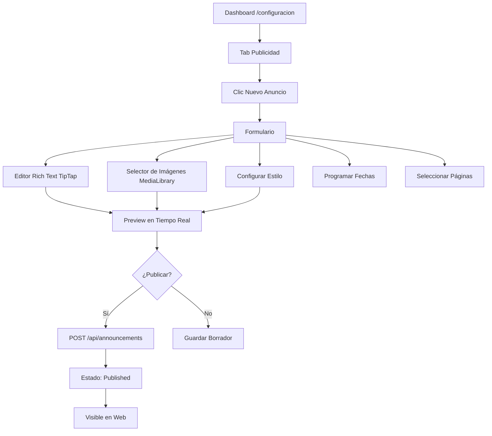
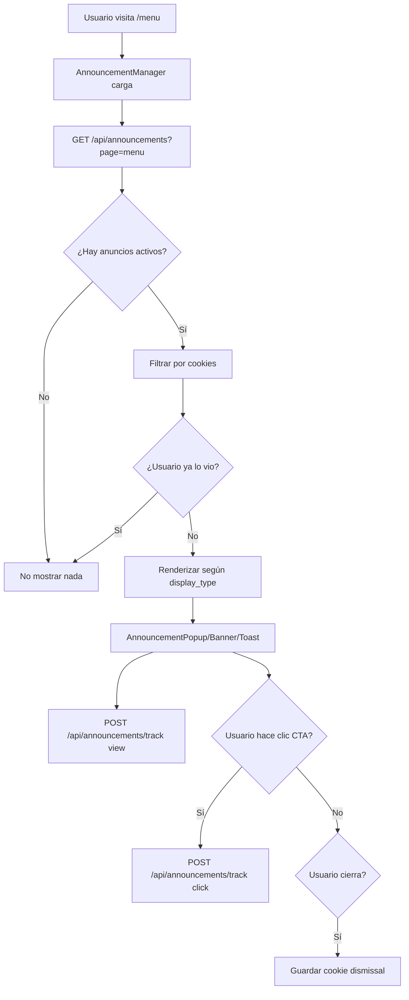

# 🎯 Plan: Sistema de Gestión de Anuncios Pop-up para Enigma

## 📋 **Índice**
1. [Casos de Uso Prácticos](#casos-de-uso)
2. [Arquitectura del Sistema](#arquitectura)
3. [Base de Datos](#base-de-datos)
4. [Componentes Frontend](#componentes)
5. [API Routes](#api-routes)
6. [Flujo de Trabajo](#flujo)
7. [Plan de Implementación](#implementacion)

---

## 🎪 **CASOS DE USO PRÁCTICOS**

### **Caso 1: Menú Especial de San Valentín (14 Feb)**

**Contexto:**
Es 1 de febrero. Quieres promocionar tu menú especial de San Valentín con antelación.

**Acción en Dashboard:**
1. Dashboard → Configuración → **Tab "Publicidad"**
2. Clic **"Nuevo Anuncio"**
3. **Tipo:** "Evento Especial"
4. **Título:** "❤️ Menú Romántico de San Valentín"
5. **Contenido:**
   ```
   Celebra el amor con nuestra propuesta culinaria especial:

   🥂 Aperitivo: Crema de calabaza con virutas de trufa
   🦐 Entrante: Tartar de gambas y aguacate
   🥩 Principal: Solomillo de ternera con reducción de vino tinto
   🍰 Postre: Coulant de chocolate con helado artesanal

   Precio por pareja: 85€
   Incluye: Copa de cava y café
   ```
6. **Imagen:** Subir foto del plato principal
7. **Call-to-Action:**
   - Texto: "Reservar Ahora"
   - URL: `/reservas?occasion=san-valentin`
8. **Programación:**
   - Fecha inicio: 1 Feb 2025, 00:00
   - Fecha fin: 14 Feb 2025, 23:59
9. **Páginas:** Solo en `/` (home) y `/menu`
10. **Preview** → Ver cómo se verá el pop-up
11. **Guardar y Activar**

**Resultado:**
- ✅ Pop-up aparece automáticamente del 1-14 Feb
- ✅ Solo en home y menu
- ✅ Usuarios pueden cerrar y no volver a ver (cookie 24h)
- ✅ Click en "Reservar Ahora" → formulario con ocasión pre-seleccionada
- ✅ Se desactiva automáticamente el 15 Feb

---

### **Caso 2: Plato del Día con Stock Limitado**

**Contexto:**
Martes por la mañana. Tienes pulpo fresco recién llegado de la lonja. Quieres promocionarlo solo HOY.

**Acción en Dashboard:**
1. Dashboard → Configuración → **Tab "Publicidad"**
2. Clic **"Nuevo Anuncio Rápido"** (template)
3. **Tipo:** "Plato del Día"
4. **Título:** "🐙 Pulpo a la Brasa - Recién de la Lonja"
5. **Contenido:**
   ```
   Solo Hoy: Pulpo gallego a la brasa

   Acabamos de recibir pulpo fresco de la lonja local.
   Preparado con nuestro toque especial: papada ibérica,
   pimentón de la Vera y aceite de oliva virgen extra.

   Disponible: 12 raciones
   Precio: 24€
   ```
6. **Imagen:** Foto del pulpo (desde media library)
7. **Badge:** "SOLO HOY" (color rojo)
8. **Call-to-Action:**
   - Texto: "Pre-Pedir Ahora"
   - URL: `/menu?item=pulpo-brasa&preorder=true`
9. **Programación:**
   - Fecha inicio: Hoy 09:00
   - Fecha fin: Hoy 23:00
10. **Páginas:** Todas las páginas
11. **Estilo:** Banner superior (menos invasivo que pop-up)
12. **Publicar**

**Resultado:**
- ✅ Banner aparece en top de todas las páginas
- ✅ Se auto-desactiva a las 23:00
- ✅ Click lleva directamente al menú con el ítem destacado
- ✅ Pre-pedidos incrementan reservas del día
- ✅ Puedes actualizar contador "Quedan X raciones" en tiempo real

---

### **Caso 3: Nueva Carta de Vinos - Campaña Educativa**

**Contexto:**
Has renovado tu carta de vinos. Quieres educar a clientes sobre las nuevas referencias durante 2 semanas.

**Acción en Dashboard:**
1. Dashboard → Configuración → **Tab "Publicidad"**
2. **Crear Serie de Anuncios** (Campaña)
3. **Anuncio 1 - Semana 1:**
   - **Tipo:** "Novedad"
   - **Título:** "🍷 Renovamos Nuestra Carta de Vinos"
   - **Contenido:**
     ```
     Descubre nuestra nueva selección:

     ✨ 8 referencias D.O. Rías Baixas (Albariño premium)
     ✨ 5 tintos Ribera del Duero (cosecha 2021)
     ✨ 3 espumosos catalanes (método tradicional)

     Maridajes perfectos con nuestra cocina mediterránea.
     Pregunta a nuestro sumiller por recomendaciones.
     ```
   - **Imagen:** Foto de la bodega con las botellas
   - **Call-to-Action:**
     - Texto: "Ver Carta de Vinos"
     - URL: `/menu?section=vinos`
   - **Fechas:** 15-21 Oct
   - **Páginas:** Home, Menu, Reservas

4. **Anuncio 2 - Semana 2:**
   - **Tipo:** "Promoción"
   - **Título:** "🎁 Descuento Especial: Carta de Vinos"
   - **Contenido:**
     ```
     Promoción Lanzamiento - Solo esta semana:

     🍾 20% descuento en botellas de vino
     🥂 Copa de bienvenida GRATIS con menú degustación

     Válido 22-28 Oct. Reserva y menciona este anuncio.
     ```
   - **Call-to-Action:**
     - Texto: "Reservar con Promoción"
     - URL: `/reservas?promo=vinos-launch`
   - **Fechas:** 22-28 Oct
   - **Estilo:** Pop-up modal (más destacado)

5. **Preview Campaña** → Ver secuencia completa
6. **Programar Ambos**

**Resultado:**
- ✅ Anuncio 1 aparece semana 1 (educativo)
- ✅ Anuncio 2 aparece semana 2 (promoción)
- ✅ Transición automática sin intervención manual
- ✅ Tracking: clicks, conversiones a reservas
- ✅ Analytics: "Promoción vinos generó 18 reservas"

---

## 🏗️ **ARQUITECTURA DEL SISTEMA**

### **Stack Tecnológico**
```
Frontend:
- Next.js 15 (App Router)
- Shadcn/ui + Radix Dialog/Modal
- TipTap Editor (rich text WYSIWYG)
- Framer Motion (animaciones)
- React Hook Form + Zod (validación)

Backend:
- Supabase PostgreSQL
- Next.js API Routes
- RLS Policies (seguridad)
- Edge Functions (scheduling)

Storage:
- ImageKit.io (imágenes)
- Media Library (reutilizar existente)

Tracking:
- LocalStorage (cookies para "no mostrar de nuevo")
- Google Analytics (event tracking)
```

---

## 🗄️ **BASE DE DATOS**

### **Nueva Tabla: `restaurante.announcements`**

```sql
CREATE TABLE restaurante.announcements (
  -- Identificación
  id TEXT PRIMARY KEY DEFAULT gen_random_uuid()::text,
  restaurant_id TEXT NOT NULL DEFAULT 'rest_enigma_001',

  -- Contenido Multiidioma
  title TEXT NOT NULL,
  title_en TEXT,
  title_de TEXT,

  content TEXT NOT NULL, -- Rich text HTML
  content_en TEXT,
  content_de TEXT,

  -- Tipo y Categoría
  type TEXT NOT NULL CHECK (type IN (
    'event',      -- Eventos especiales
    'daily_dish', -- Plato del día
    'promotion',  -- Promociones
    'news',       -- Noticias generales
    'menu_update' -- Actualizaciones de menú
  )),

  -- Visualización
  display_type TEXT NOT NULL CHECK (display_type IN (
    'popup',      -- Modal centro pantalla
    'banner',     -- Banner superior
    'toast',      -- Notificación esquina
    'sidebar'     -- Panel lateral
  )),

  -- Estado
  is_active BOOLEAN DEFAULT true,
  is_published BOOLEAN DEFAULT false,
  display_order INTEGER DEFAULT 0,

  -- Targeting (¿Dónde mostrar?)
  pages TEXT[] DEFAULT ARRAY['all']::TEXT[], -- ['all'], ['home'], ['menu', 'reservas']

  -- Diseño y Estilo
  theme TEXT DEFAULT 'default' CHECK (theme IN (
    'default',    -- Colores Enigma
    'valentine',  -- San Valentín (rojos/rosas)
    'christmas',  -- Navidad (verde/rojo)
    'summer',     -- Verano (azul/amarillo)
    'custom'      -- Colores personalizados
  )),

  background_color TEXT DEFAULT '#237584', -- Atlantic Blue
  text_color TEXT DEFAULT '#FFFFFF',
  border_color TEXT,

  -- Medios
  image_url TEXT, -- URL de ImageKit
  image_alt TEXT,
  video_url TEXT, -- Opcional: video de YouTube/Vimeo

  -- Badge/Etiqueta
  badge_text TEXT, -- "NUEVO", "SOLO HOY", "LIMITADO"
  badge_color TEXT DEFAULT '#EF4444', -- Red-500

  -- Call to Action
  cta_text TEXT, -- "Reservar Ahora", "Ver Menú", "Más Info"
  cta_url TEXT,
  cta_button_color TEXT DEFAULT '#237584',

  -- Programación
  start_date TIMESTAMPTZ,
  end_date TIMESTAMPTZ,

  -- Interacción
  is_dismissible BOOLEAN DEFAULT true,
  show_once_per_session BOOLEAN DEFAULT false, -- Cookie sesión
  show_once_per_day BOOLEAN DEFAULT true,      -- Cookie 24h
  max_displays_per_user INTEGER DEFAULT NULL,  -- Límite de visualizaciones

  -- Analytics
  views_count INTEGER DEFAULT 0,
  clicks_count INTEGER DEFAULT 0,
  conversion_count INTEGER DEFAULT 0, -- Reservas generadas

  -- Metadata
  created_by TEXT REFERENCES auth.users(id),
  created_at TIMESTAMPTZ DEFAULT now(),
  updated_at TIMESTAMPTZ DEFAULT now(),

  -- Constraints
  CONSTRAINT valid_date_range CHECK (
    start_date IS NULL OR
    end_date IS NULL OR
    end_date > start_date
  )
);

-- Índices para performance
CREATE INDEX idx_announcements_active ON restaurante.announcements(is_active, is_published);
CREATE INDEX idx_announcements_dates ON restaurante.announcements(start_date, end_date);
CREATE INDEX idx_announcements_type ON restaurante.announcements(type);

-- RLS Policies
ALTER TABLE restaurante.announcements ENABLE ROW LEVEL SECURITY;

-- Public read: Solo anuncios activos y publicados dentro de fechas
CREATE POLICY "Public can view active announcements"
  ON restaurante.announcements FOR SELECT
  USING (
    is_active = true
    AND is_published = true
    AND (start_date IS NULL OR start_date <= now())
    AND (end_date IS NULL OR end_date >= now())
  );

-- Admins can do everything
CREATE POLICY "Admins can manage announcements"
  ON restaurante.announcements FOR ALL
  USING (
    EXISTS (
      SELECT 1 FROM restaurante.users
      WHERE users.id = auth.uid()
      AND users.role IN ('admin', 'manager')
    )
  );
```

### **Tabla de Tracking: `restaurante.announcement_interactions`**

```sql
CREATE TABLE restaurante.announcement_interactions (
  id TEXT PRIMARY KEY DEFAULT gen_random_uuid()::text,
  announcement_id TEXT NOT NULL REFERENCES restaurante.announcements(id) ON DELETE CASCADE,

  -- Tipo de interacción
  interaction_type TEXT NOT NULL CHECK (interaction_type IN (
    'view',       -- Usuario vio el anuncio
    'click',      -- Click en CTA
    'dismiss',    -- Cerró el anuncio
    'conversion'  -- Completó acción (reserva)
  )),

  -- Contexto
  page_url TEXT,
  user_agent TEXT,
  ip_address TEXT, -- Anonimizado (solo primeros 3 octetos)

  -- Timestamps
  created_at TIMESTAMPTZ DEFAULT now()
);

CREATE INDEX idx_interactions_announcement ON restaurante.announcement_interactions(announcement_id);
CREATE INDEX idx_interactions_type ON restaurante.announcement_interactions(interaction_type);
```

---

## 🎨 **COMPONENTES FRONTEND**

### **Estructura de Archivos**

```
src/
├── app/(admin)/dashboard/configuracion/
│   ├── components/
│   │   ├── sections/
│   │   │   └── announcements-section.tsx       # ✨ NUEVO
│   │   └── forms/
│   │       └── announcement-form.tsx           # ✨ NUEVO
│   └── page.tsx                                # Agregar tab
│
├── components/announcements/
│   ├── AnnouncementPopup.tsx                   # ✨ NUEVO - Modal
│   ├── AnnouncementBanner.tsx                  # ✨ NUEVO - Banner
│   ├── AnnouncementToast.tsx                   # ✨ NUEVO - Toast
│   ├── AnnouncementPreview.tsx                 # ✨ NUEVO - Preview
│   ├── AnnouncementManager.tsx                 # ✨ NUEVO - Orchestrator
│   └── RichTextEditor.tsx                      # ✨ NUEVO - TipTap
│
├── hooks/
│   └── use-announcements.ts                    # ✨ NUEVO
│
└── app/api/announcements/
    ├── route.ts                                # ✨ NUEVO - CRUD
    ├── [id]/route.ts                           # ✨ NUEVO - Single
    ├── [id]/publish/route.ts                   # ✨ NUEVO - Publish
    └── [id]/analytics/route.ts                 # ✨ NUEVO - Stats
```

### **Component 1: AnnouncementManager (Orchestrator)**

**Propósito:** Componente global que decide qué anuncio mostrar y cuándo.

```typescript
// src/components/announcements/AnnouncementManager.tsx
'use client'

import { useEffect, useState } from 'react'
import { usePathname } from 'next/navigation'
import { useAnnouncements } from '@/hooks/use-announcements'
import { AnnouncementPopup } from './AnnouncementPopup'
import { AnnouncementBanner } from './AnnouncementBanner'
import { AnnouncementToast } from './AnnouncementToast'

export function AnnouncementManager() {
  const pathname = usePathname()
  const { activeAnnouncements, trackView, trackClick } = useAnnouncements()
  const [visibleAnnouncement, setVisibleAnnouncement] = useState(null)

  useEffect(() => {
    // Filtrar anuncios para la página actual
    const announcements = activeAnnouncements.filter(ann =>
      ann.pages.includes('all') ||
      ann.pages.some(page => pathname.includes(page))
    )

    // Ordenar por prioridad
    const sorted = announcements.sort((a, b) => b.display_order - a.display_order)

    // Verificar cookies de "no mostrar"
    const announcement = sorted.find(ann => !hasBeenDismissed(ann.id))

    if (announcement) {
      setVisibleAnnouncement(announcement)
      trackView(announcement.id)
    }
  }, [pathname, activeAnnouncements])

  if (!visibleAnnouncement) return null

  // Renderizar según tipo
  switch (visibleAnnouncement.display_type) {
    case 'popup':
      return <AnnouncementPopup announcement={visibleAnnouncement} />
    case 'banner':
      return <AnnouncementBanner announcement={visibleAnnouncement} />
    case 'toast':
      return <AnnouncementToast announcement={visibleAnnouncement} />
    default:
      return null
  }
}
```

### **Component 2: AnnouncementPopup**

```typescript
// src/components/announcements/AnnouncementPopup.tsx
'use client'

import { Dialog, DialogContent } from '@/components/ui/dialog'
import { Button } from '@/components/ui/button'
import { Badge } from '@/components/ui/badge'
import { X } from 'lucide-react'
import Image from 'next/image'
import { useState } from 'react'

export function AnnouncementPopup({ announcement }) {
  const [open, setOpen] = useState(true)

  const handleClose = () => {
    setOpen(false)
    // Guardar cookie para no volver a mostrar
    if (announcement.show_once_per_day) {
      setCookie(`announcement_${announcement.id}`, 'dismissed', 1)
    }
  }

  const handleCTA = () => {
    trackClick(announcement.id)
    window.location.href = announcement.cta_url
  }

  return (
    <Dialog open={open} onOpenChange={setOpen}>
      <DialogContent
        className="max-w-2xl p-0 overflow-hidden"
        style={{
          backgroundColor: announcement.background_color,
          borderColor: announcement.border_color
        }}
      >
        {/* Close Button */}
        {announcement.is_dismissible && (
          <button
            onClick={handleClose}
            className="absolute top-4 right-4 z-50 rounded-full bg-white/80 p-2 hover:bg-white"
          >
            <X className="h-4 w-4" />
          </button>
        )}

        {/* Image */}
        {announcement.image_url && (
          <div className="relative h-64 w-full">
            <Image
              src={announcement.image_url}
              alt={announcement.image_alt || announcement.title}
              fill
              className="object-cover"
            />
          </div>
        )}

        {/* Content */}
        <div className="p-8 space-y-6">
          {/* Badge */}
          {announcement.badge_text && (
            <Badge
              className="text-xs font-bold"
              style={{ backgroundColor: announcement.badge_color }}
            >
              {announcement.badge_text}
            </Badge>
          )}

          {/* Title */}
          <h2
            className="text-3xl font-bold"
            style={{ color: announcement.text_color }}
          >
            {announcement.title}
          </h2>

          {/* Content (Rich Text) */}
          <div
            className="prose prose-lg"
            style={{ color: announcement.text_color }}
            dangerouslySetInnerHTML={{ __html: announcement.content }}
          />

          {/* CTA Button */}
          {announcement.cta_text && (
            <Button
              onClick={handleCTA}
              size="lg"
              className="w-full"
              style={{ backgroundColor: announcement.cta_button_color }}
            >
              {announcement.cta_text}
            </Button>
          )}
        </div>
      </DialogContent>
    </Dialog>
  )
}
```

### **Component 3: RichTextEditor (TipTap)**

```typescript
// src/components/announcements/RichTextEditor.tsx
'use client'

import { useEditor, EditorContent } from '@tiptap/react'
import StarterKit from '@tiptap/starter-kit'
import Link from '@tiptap/extension-link'
import Image from '@tiptap/extension-image'
import { Button } from '@/components/ui/button'
import { Bold, Italic, Link as LinkIcon, Image as ImageIcon } from 'lucide-react'

export function RichTextEditor({ value, onChange }) {
  const editor = useEditor({
    extensions: [
      StarterKit,
      Link.configure({ openOnClick: false }),
      Image
    ],
    content: value,
    onUpdate: ({ editor }) => {
      onChange(editor.getHTML())
    }
  })

  if (!editor) return null

  return (
    <div className="border rounded-md">
      {/* Toolbar */}
      <div className="flex gap-2 p-2 border-b">
        <Button
          type="button"
          variant="ghost"
          size="sm"
          onClick={() => editor.chain().focus().toggleBold().run()}
          className={editor.isActive('bold') ? 'bg-muted' : ''}
        >
          <Bold className="h-4 w-4" />
        </Button>
        <Button
          type="button"
          variant="ghost"
          size="sm"
          onClick={() => editor.chain().focus().toggleItalic().run()}
          className={editor.isActive('italic') ? 'bg-muted' : ''}
        >
          <Italic className="h-4 w-4" />
        </Button>
        {/* Más botones... */}
      </div>

      {/* Editor */}
      <EditorContent editor={editor} className="prose p-4 min-h-[200px]" />
    </div>
  )
}
```

---

## 🔌 **API ROUTES**

### **GET /api/announcements** - Listar anuncios activos

```typescript
// src/app/api/announcements/route.ts
import { createClient } from '@/lib/supabase/server'
import { NextResponse } from 'next/server'

export async function GET(request: Request) {
  const supabase = createClient()

  // Query params para filtrado
  const { searchParams } = new URL(request.url)
  const page = searchParams.get('page') || 'all'

  let query = supabase
    .from('announcements')
    .select('*')
    .eq('is_active', true)
    .eq('is_published', true)

  // Filtrar por página si se especifica
  if (page !== 'all') {
    query = query.or(`pages.cs.{${page}},pages.cs.{all}`)
  }

  // Filtrar por fechas
  const now = new Date().toISOString()
  query = query
    .or(`start_date.is.null,start_date.lte.${now}`)
    .or(`end_date.is.null,end_date.gte.${now}`)

  const { data, error } = await query.order('display_order', { ascending: false })

  if (error) {
    return NextResponse.json({ error: error.message }, { status: 500 })
  }

  return NextResponse.json(data)
}

export async function POST(request: Request) {
  const supabase = createClient()
  const body = await request.json()

  // Verificar auth admin
  const { data: { user } } = await supabase.auth.getUser()
  if (!user) {
    return NextResponse.json({ error: 'Unauthorized' }, { status: 401 })
  }

  const { data, error } = await supabase
    .from('announcements')
    .insert({
      ...body,
      created_by: user.id
    })
    .select()
    .single()

  if (error) {
    return NextResponse.json({ error: error.message }, { status: 500 })
  }

  return NextResponse.json(data)
}
```

---

## 🔄 **FLUJO DE TRABAJO**

### **Crear y Publicar Anuncio**



### **Mostrar Anuncio en Web Pública**



---

## 📅 **PLAN DE IMPLEMENTACIÓN**

### **FASE 1: Base de Datos y API (Día 1-2)**

**Prioridad:** ⭐⭐⭐ CRÍTICA

✅ **Tareas:**
1. Crear migration para tabla `announcements`
2. Crear migration para tabla `announcement_interactions`
3. Configurar RLS policies
4. Crear API routes:
   - `GET /api/announcements`
   - `POST /api/announcements`
   - `PATCH /api/announcements/[id]`
   - `DELETE /api/announcements/[id]`
   - `POST /api/announcements/[id]/publish`
   - `POST /api/announcements/track`

**Entregable:** API funcional con Postman/Insomnia

---

### **FASE 2: Hook y Utils (Día 3)**

**Prioridad:** ⭐⭐⭐ CRÍTICA

✅ **Tareas:**
1. Crear `use-announcements.ts` hook
2. Crear utilidades de cookies (`lib/cookies-announcements.ts`)
3. Crear utilidades de tracking (`lib/tracking-announcements.ts`)
4. Crear tipos TypeScript (`types/announcements.ts`)

**Entregable:** Hooks y utils testeados

---

### **FASE 3: Componentes de Visualización (Día 4-5)**

**Prioridad:** ⭐⭐⭐ ALTA

✅ **Tareas:**
1. `AnnouncementManager.tsx` - Orchestrator
2. `AnnouncementPopup.tsx` - Modal
3. `AnnouncementBanner.tsx` - Banner superior
4. `AnnouncementToast.tsx` - Notificación
5. `AnnouncementPreview.tsx` - Preview en dashboard
6. Integrar en `layout.tsx` público

**Entregable:** Pop-ups funcionando en web pública

---

### **FASE 4: Dashboard Admin (Día 6-8)**

**Prioridad:** ⭐⭐ MEDIA

✅ **Tareas:**
1. Agregar tab "Publicidad" en `/configuracion/components/config-tabs.tsx`
2. Crear `announcements-section.tsx`
3. Crear `announcement-form.tsx` con:
   - Rich Text Editor (TipTap)
   - Selector de imágenes
   - Color pickers
   - Date pickers
   - Page selector
   - Preview live
4. Crear tabla de gestión con:
   - Lista de anuncios
   - Estados (Activo/Inactivo/Programado)
   - Analytics (Views/Clicks/Conversions)
   - Acciones (Editar/Duplicar/Eliminar)

**Entregable:** Dashboard admin funcional

---

### **FASE 5: Rich Text Editor (Día 9)**

**Prioridad:** ⭐⭐ MEDIA

✅ **Tareas:**
1. Instalar TipTap: `npm install @tiptap/react @tiptap/starter-kit`
2. Crear `RichTextEditor.tsx`
3. Agregar extensiones:
   - Bold, Italic, Underline
   - Links
   - Images
   - Lists (bullets, numbered)
   - Headings
4. Integrar en `announcement-form.tsx`

**Entregable:** Editor WYSIWYG funcional

---

### **FASE 6: Analytics y Tracking (Día 10)**

**Prioridad:** ⭐ BAJA

✅ **Tareas:**
1. Crear dashboard de analytics en tab Publicidad
2. Gráficos de:
   - Views por anuncio
   - Click-through rate (CTR)
   - Conversiones (reservas)
   - Mejores horarios
3. Exportar reportes CSV

**Entregable:** Analytics dashboard

---

### **FASE 7: Templates y Presets (Día 11)**

**Prioridad:** ⭐ OPCIONAL

✅ **Tareas:**
1. Crear templates predefinidos:
   - Plato del día
   - Evento especial
   - Promoción
   - Menú semanal
2. Un clic para crear desde template
3. Biblioteca de estilos (temas)

**Entregable:** Templates reutilizables

---

### **FASE 8: Testing y Pulido (Día 12)**

**Prioridad:** ⭐⭐⭐ CRÍTICA

✅ **Tareas:**
1. Testing cross-browser (Chrome, Safari, Firefox)
2. Testing mobile (iOS, Android)
3. Testing accesibilidad (keyboard navigation)
4. Optimización performance
5. Documentación de usuario

**Entregable:** Sistema production-ready

---

## 📊 **RESUMEN TÉCNICO**

| Aspecto | Detalle |
|---------|---------|
| **Tiempo Estimado** | 12 días (~96 horas) |
| **Complejidad** | Media-Alta |
| **Dependencias** | TipTap, Framer Motion, React Hook Form |
| **Tablas Nuevas** | 2 (announcements, announcement_interactions) |
| **API Routes** | 8 endpoints |
| **Componentes** | 15+ componentes |
| **Hooks** | 3 hooks custom |

---

## 🎯 **PRÓXIMO PASO INMEDIATO**

**¿Quieres que empiece con la FASE 1 (Base de Datos y API)?**

1. ✅ Crear migration SQL
2. ✅ Crear API routes
3. ✅ Testear con Postman

**O prefieres que:**
- Ajuste el plan según tus prioridades
- Empiece por otra fase
- Explique más algún caso de uso

**¿Cómo procedemos?**
